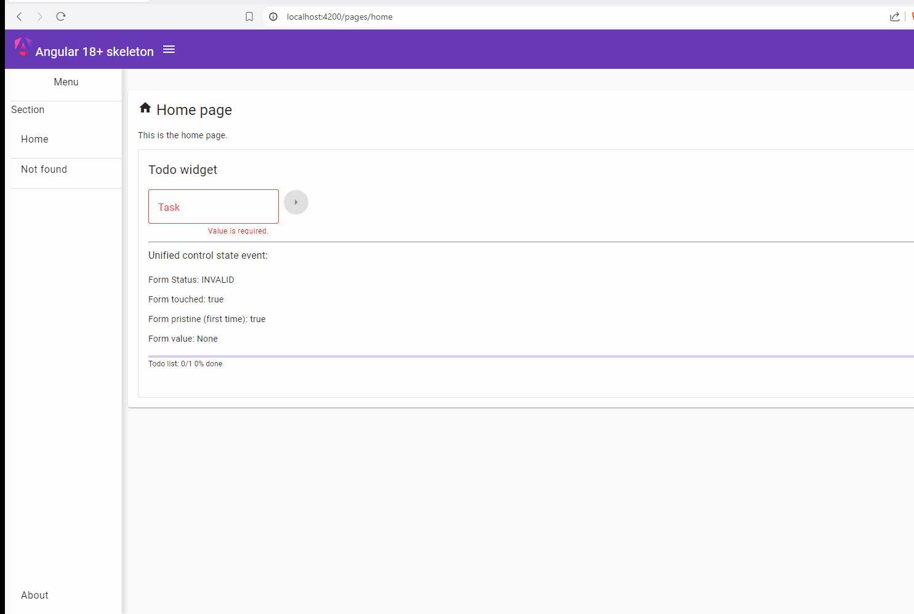

# Angular 18+ Skeleton
===
Angular 18+ starter kit to develop a Single Page Application(SPA) using Angular material, NGRX Signals, enhanced reactive forms, Jest and Cypress.
- version alpha 0.1

> **Alert note:**  This application is for demonstration purpose only and it is not intended for use in a specific production. It is too generic and not designed to be particularly efficient, stable, or secure. It does not support all the required features and specific needs of a complete production-ready solution !

---

# Table of Contents

- [Overview](#overview)
- [Setup](#setup)
- [Usage](#usage)
  - [Development server](#development-server)
  - [Debugging on Chrome browser](#debugging-on-chrome-browser)
  - [Code scaffolding](#code-scaffolding)
  - [Build](#build)
- [Further help](#further-help)
  - [Running unit tests](#running-unit-tests)
  - [Running end-to-end tests](#running-end-to-end-tests)
  - [Running code format](#running-code-format)
  - [Running code quality](#running-code-quality)
  - [Running code performance](#running-code-performance)
  - [Running code security](#running-code-security)
  - [Optional: Generate mermaid diagrams](#optional-generate-mermaid-diagrams)

# Overview

---



**5 main Features:**

1- **Angular skeleton:** Project template starter using Angular framework and development toolkit.

2- **UX/UI design :** Theme, fonts, icons, Layout, responsive page and UI components using Angular material, icons, roboto font and CDK (Angular Material Component Development Kit).

3- **Unit, integration and e2e Tests:** Unit test code samples using Jest and  e2e test code samples using Cypress.

4- **Technical documentation:** Docs, guidelines using Markdown and diagrams using Mermaid.

5- **Reactive state management:** a reactive solution usign Rxjs and @ngrx/signals (NGRX store with Angular Signals).

---

# Setup

---

Run `npm install` to install node_modules dependencies

---

# Usage
---

## Development server

Run `npm run start` or `ng serve` for a dev server. Navigate to `http://localhost:4200/`. The app will automatically reload if you change any of the source files.

## Debugging on Chrome browser

1. First, check that angular.json enabled sourcemap

```json
"architect": {
        "build": {
          "builder": "@angular-devkit/build-angular:browser",
          "options": {
            "sourceMap": {
              "scripts": true,
              "styles": true,
              "vendor": true
            },

```

2. Open the .vscode/launch.json file and add the following content. If this file doesn’t exist, then create it.
(Note: an extension browser will be needed to install)

```json
{
    "version": "0.2.0",
    "configurations": [
      {
        "name": "Debug with chrome browser",
        "type": "chrome",
        "request": "launch",
        "preLaunchTask": "npm: start",
        "url": "http://localhost:4200/#",
        "webRoot": "${workspaceFolder}",
        "sourceMapPathOverrides": {
          "webpack:/*": "${webRoot}/*",
          "/./*": "${webRoot}/*",
          "/src/*": "${webRoot}/*",
          "/*": "*",
          "/./~/*": "${webRoot}/node_modules/*"
        }
      }
    ]
  }
```

3. If tasks.json file doesn't exist, Add it with the following configuration.


```json
{
    "version": "2.0.0",
    "tasks": [
      {
        "type": "npm",
        "script": "start",
        "isBackground": true,
        "presentation": {
          "focus": true,
          "panel": "dedicated"
        },
        "group": {
          "kind": "build",
          "isDefault": true
        },
        "problemMatcher": {
          "owner": "typescript",
          "source": "ts",
          "applyTo": "closedDocuments",
          "fileLocation": [
            "relative",
            "${cwd}"
          ],
          "pattern": "$tsc",
          "background": {
            "activeOnStart": true,
            "beginsPattern": {
              "regexp": "(.*?)"
            },
            "endsPattern": {
              "regexp": "Compiled |Failed to compile."
            }
          }
        }
      }
    ]
  }
```

4. To start a debugging session, hit the `F5` key or click `RUN>START DEBUGGING` and a terminal will open which will begin serving your web app, and a browser window will also open. Now **if you add a breakpoint to your application code**, you will be able to step through the code.

## Code scaffolding

Run `ng generate component component-name` to generate a new component. You can also use `ng generate directive|pipe|service|class|guard|interface|enum|module`.

Further IDE tools: 
  - In your edited file, type with autocompletion `sm-` to generate a new template. 
  - For template folder, Use Vscode addon `Template generator`'s procedure.

## Build

Run `ng build` to build the project. The build artifacts will be stored in the `www/` directory. Use the `--prod` flag for a production build.

## Running unit tests

Run `npm run test` to execute the unit tests via [Jest.js](https://jestjs.io/).

## Running end-to-end tests

Run `npm run e2e` to execute the end-to-end tests via [Cypress](https://www.cypress.io/).

## Further help

To get more help on the Angular CLI use `ng help` or go check out the [Angular CLI Overview and Command Reference](https://angular.io/cli) page.

### Environment

After the release of Angular CLI 15.1, a generation schematic will be available to add environment files for all existing build configurations within a project. Example usage:

`ng g environments`

### Running code format

Run `npm run code-format` to execute automatic formatting of the code via [Prettier](https://prettier.io/)

### Running code quality

Run `npm run code-quality` to execute a linter scan of the code via [ESlint](https://eslint.org/)

### Running code performance

Run `npm run code-perf` to execute an audit performance of the code via [Lighthouse](https://www.npmjs.com/package/lighthouse)
> **Alert note:** First run the application (to get the url https://localhost:4200) with `npm run start` 

### Running code security

Run `npm run code:security` to execute a security scan of the code via [Npm audit](https://docs.npmjs.com/cli/v10/commands/npm-audit)

### Optional: Generate mermaid diagrams

Install globally `npm install -g @mermaid-js/mermaid-cli`
Run `npm run diagram-file` to generate diagrams file for markdown file via [Mermaid cli](https://github.com/mermaid-js/mermaid-cli)