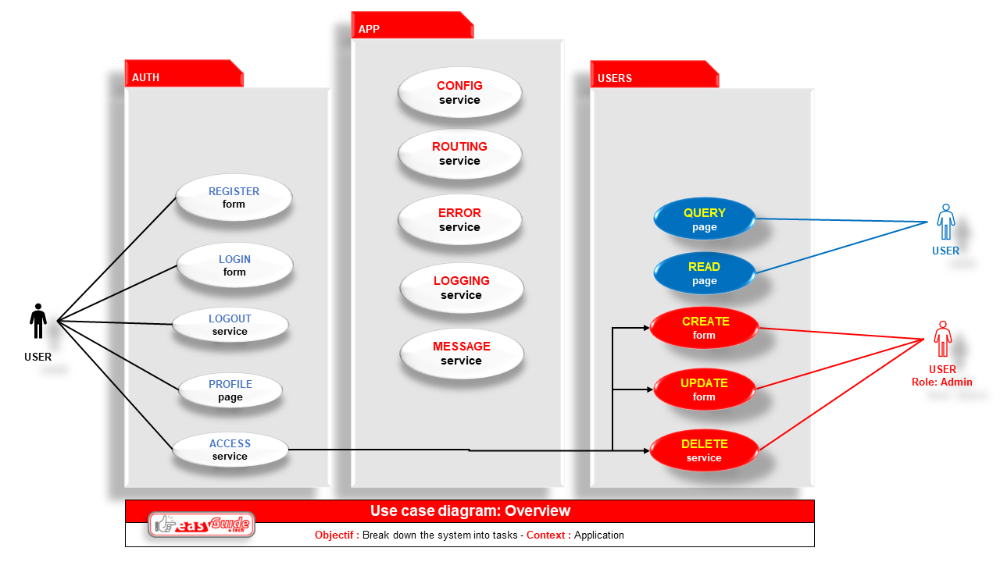
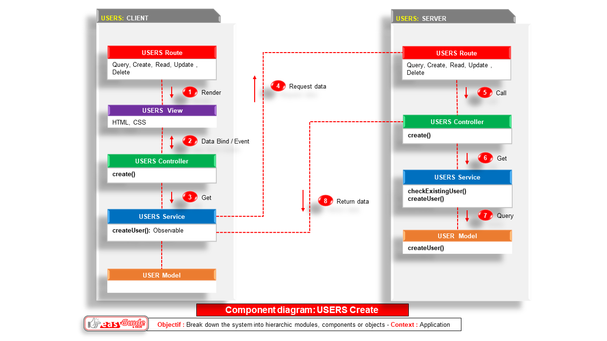
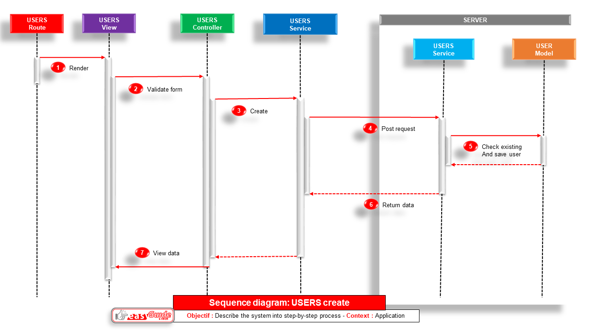
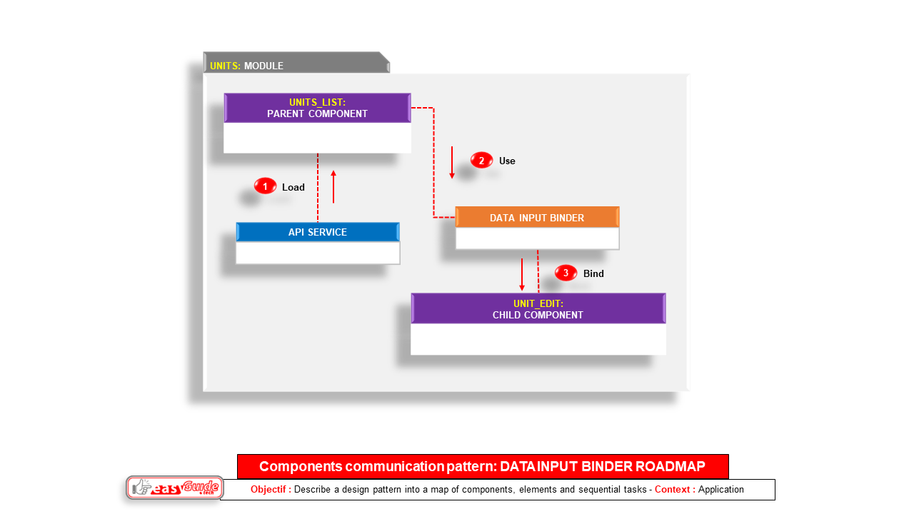
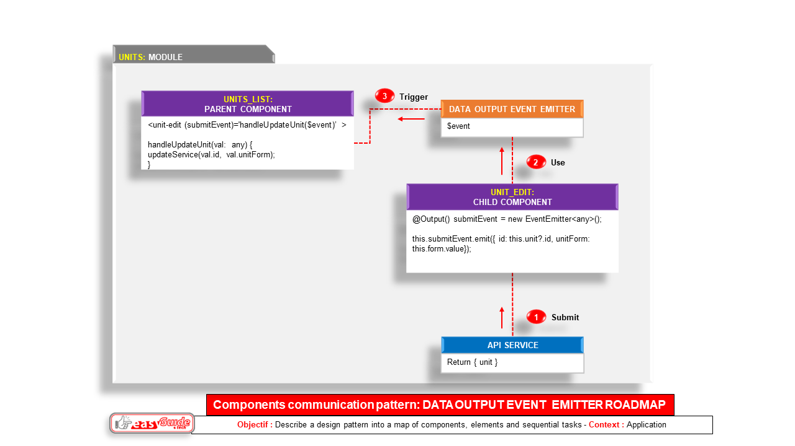
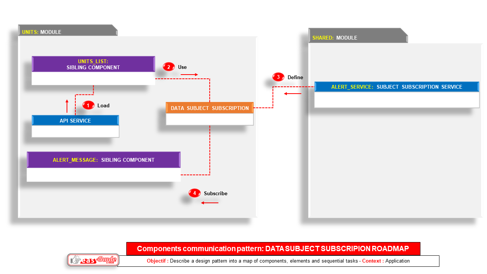
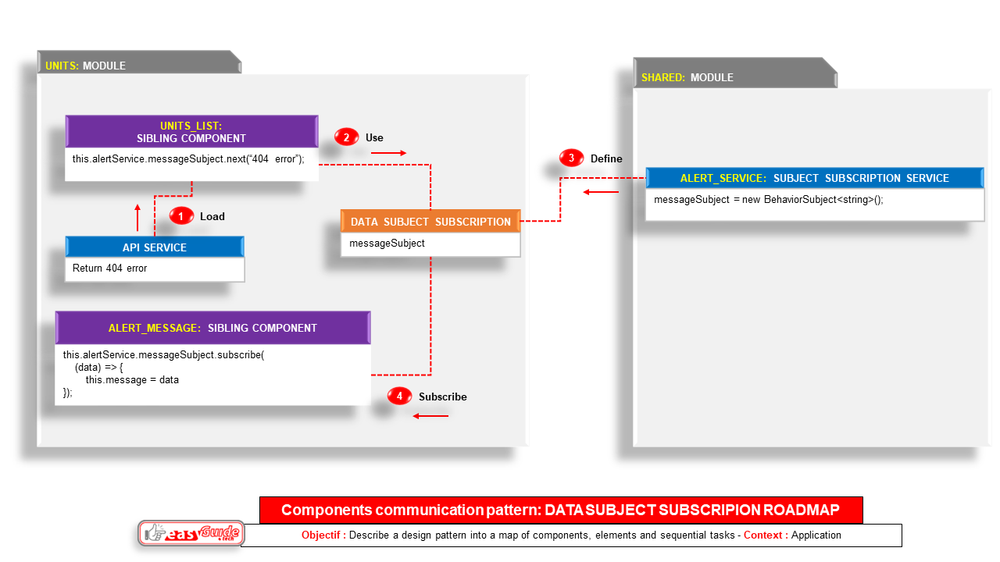
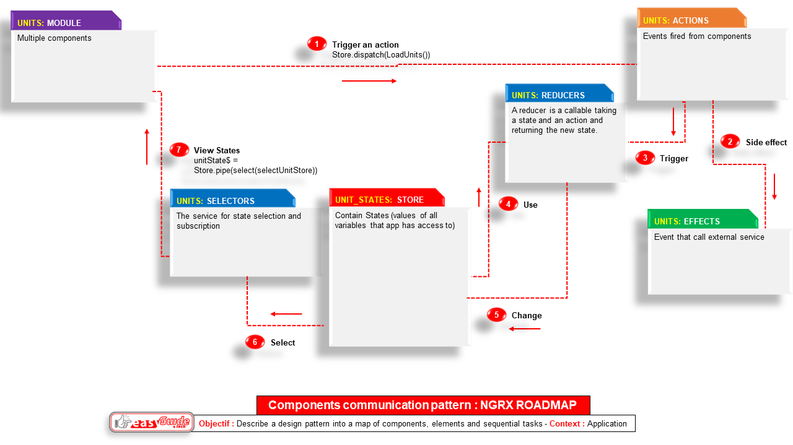
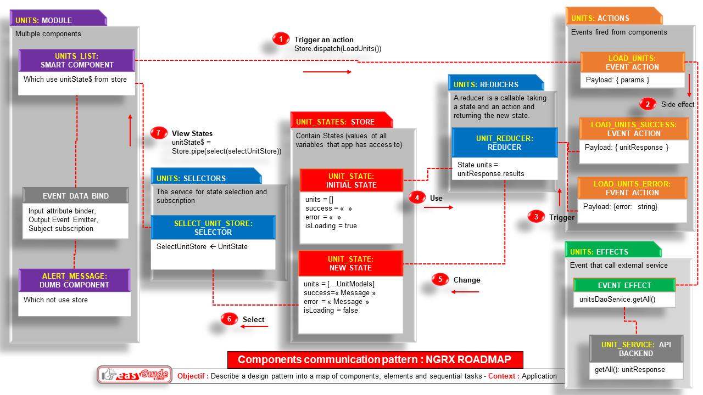

QUICK CODING
==================================================
Snippet guideline for project with angular framework
--------------------------------------------------


# Introduction
--------------
* **Context** : As a developer, i want to be able to implement quickly the boring repetitive tasks of applying local conventions in new  added codes.

* **Interest** : Automate repetitive conventions to gain time and focus only in business code implementation and regular refactoring.

* **Plan** :  
    1. Setup
    2. Features
    3. Structures
    4. Materials

---

**TABLE OF CONTENTS**

<!-- TOC -->

- [Introduction](#introduction)
- [Setup](#setup)
    - [Component template](#component-template)
    - [code snippets](#code-snippets)
- [Features](#features)
- [Structures](#structures)
    - [Architecture overview](#architecture-overview)
        - [Use case diagram : Business context](#use-case-diagram--business-context)
        - [Class diagram : Hierarchic structure](#class-diagram--hierarchic-structure)
        - [Sequence diagram : Logic process](#sequence-diagram--logic-process)
        - [Roadmap diagram : Communication patterns](#roadmap-diagram--communication-patterns)
            - [Input binder](#input-binder)
            - [Output even emitter](#output-even-emitter)
            - [Subject subscription](#subject-subscription)
            - [NGRX: store of states](#ngrx-store-of-states)
- [Materials](#materials)
    - [Angular Typescrit Snippets](#angular-typescrit-snippets)
        - [How to create snippets](#how-to-create-snippets)
            - [JSON Structure of the snippet](#json-structure-of-the-snippet)
            - [Snippets in project](#snippets-in-project)
            - [JSON Escaper](#json-escaper)
            - [Dynamic variables in snippets](#dynamic-variables-in-snippets)
        - [How to use snippets](#how-to-use-snippets)
        - [Object snippets](#object-snippets)
            - [sm-component-with-service](#sm-component-with-service)
            - [sm-service](#sm-service)
            - [sm-service-http](#sm-service-http)
            - [sm-router-appmodule](#sm-router-appmodule)
            - [sm-router-featuremodule](#sm-router-featuremodule)
            - [sm-communication-input](#sm-communication-input)
            - [sm-communication-output](#sm-communication-output)
            - [sm-communication-subject](#sm-communication-subject)
            - [sm-communication-viewchild-component](#sm-communication-viewchild-component)
            - [sm-communication-viewchild-dom](#sm-communication-viewchild-dom)
            - [sm-communication-ngrx](#sm-communication-ngrx)
- [Conclusion](#conclusion)
- [Credits](#credits)

<!-- /TOC -->


# Setup
------------

## Install / Update

In order to update the angular-cli package installed globally in your system, you need to run:
```shell
npm uninstall -g angular-cli
npm install -g @angular/cli@latest
```


- **To also update your local project version**, because inside your project directory it will be selected with higher priority than the global one:

```shell
npx rimraf --glob node_modules
npm uninstall --save-dev angular-cli
npm install --save-dev @angular/cli@latest
npm install
```

## Update migration to latest version

- Use online steps: https://update.angular.io/


## To update nodejs version
---
- See https://nodejs.org/en/

- or 
```shell
npm cache clean -f
npm install -g n
```
## Component template

* Example to generate a default component with Angular cli
```shell
ng g component exampleComponent
```

## code snippets
in vsCode editor, type the first letters of any of the snippets angular commands :

* Example to generate a component with an injected service
```shell
sm-component-with-service
```

# Features
----------
* Quick understand of the anatomy of local code

* **Architecture**: Project folder structure and design pattern.
* **Elements**: Code pattern and generator for **classes, components, services, directives and pipes**.
* **Routing**: Code pattern and generator for the business-line **Route**.
* **Remote request**: Code pattern for services that involve the **API remote services**.
* **Interaction**: Code pattern for  interaction between **parent-child** and **sibling** components.
* **Form**: Code pattern for form inputs and validation.
* **tests**: Code pattern for unit and functional tests (see second guideline)


# Structures
------------

## Architecture overview

### Project folder structure


### Use case diagram : Business context




### Class diagram : Hierarchic structure



### Sequence diagram : Logic process




### Roadmap diagram : Communication patterns

#### Input binder



- **Snippet sm-communication-input**:
```ts
// <child-component [childData]='parentData'></child-component>
// export class ParentComponent {
//    parentData = ..
// }
// 
// Init input data in child component
import { Input } from '@angular/core'
@Input() childData: Name;

```


#### Output even emitter





- **Snippet sm-communication-output**:
```ts
// <child-component (childEvent)='parentAction(event)'></child-component>
// export class ParentComponent { 
//    parentAction(childEvent) {
//        this.parentData = childEvent
//    }
// }
// 
// Init output data in child component
import { Output, EventEmitter } from '@angular/core'
@Output() childEvent = new EventEmitter<ClassType>()
this.childEvent.emit(this.value)

```

#### Subject subscription





- **Snippet sm-communication-subject**:
```ts

// To subscribe to the subject changes with the subscribe() method
// export class SiblingComponent1 { 
//    ngOnInit() {
//        this.FeatureService.currentFeatureSubject.subscribe((data) => {this.currentData = data});
//    }
// }
// 
// To publish subject changes to the listeners with the next() method
// export class SiblingComponent2 { 
//    ngOnInit() {
//        this.currentData = 'Welcome';
//        this.FeatureService.currentFeatureSubject.next(this.currentData);
//    }
// }
// 
// To init Subject 
import { BehaviorSubject } from 'rxjs'
export class FeatureService implements IFeatureData {
    currentFeatureSubject = new BehaviorSubject<IFeatureData>(
        {
            title: 'default string value',
            description: 'default text value',
        }
    );

}
```


#### NGRX: store of states





##### Phase 0: The store add a new state as a new shared global variable
---
* `src/store/states/units.states.ts`
```ts
export interface UnitState {
    units: UnitModel[];
    unit: UnitModel | null;
    isLoading: boolean;
    success: string;
    error: string;
}
  
export const initialUnitState: UnitState = {
    units: [],
    unit: null,
    isLoading: false,
    success: '',
    error: '',
};
```
##### Phase 1 : The smart component trigger an action
---
* `src/units/list/list.component.ts`
* The smart component `ListComponent` will listen to the state `unitState$` from the store `this.store`
```ts
unitState$: Observable<UnitState> = this.store.pipe(
    select(selectUnitsStore),
  );
```

* On init, the smart component `ListComponent` trigger the action `loadUnits()` on the store `this.store` to feed its state `unitState$`
```ts
// Get units state
    this.store.dispatch(loadUnits());
```

##### Phase 2 : The action add a side effect which call a service
---
* `src/store/actions/units.action.ts`
```ts
export const loadUnits = createAction(
  "[UnitModel] loadUnits"
);

export const loadUnitsSuccess = createAction(
  "[UnitModel] loadUnitsSuccess",
  props<{unitsResponse: UnitsResponseInterface}>()
);

export const loadUnitsFail = createAction(
  "[UnitModel] loadUnitsFail",
  props<{ error: string }>()
);
```

* `src/store/effects/units.effects.ts`
```ts
loadUnits$ = createEffect(() =>
    this.actions$.pipe(
      ofType(unitActions.loadUnits),
      mergeMap(() =>
        this.unitsDaoService.getAll().pipe(
          map((unitsResponse) =>
            unitActions.loadUnitsSuccess({
              unitsResponse,
            })
          ),
          catchError((error) => of(unitActions.loadUnitsFail({ error })))
        )
      )
    )
  );

```

##### Phase 3 : The action result (success or error) trigger The reducer to change the states in the store
---
* `src/store/reducers/units.reducers.ts`
```ts
/*loads the list of units*/
  on(UnitActions.loadUnits, (state) => ({
    ...state,
    isLoading: true,
    success: '',
  })),
  on(UnitActions.loadUnitsSuccess, (state, { unitsResponse }) => ({
    ...state,
    units: unitsResponse.results as UnitModel[],
    isLoading: false,
    success:  `Success load units`,
  })),
  on(UnitActions.loadUnitsFail, (state, { error }) => ({
    ...state,
    error,
    isLoading: false,
  })),
```
##### Phase 4 : The selector select a state for the smart component
---
* `src/store/selectors/units.selectors.ts`
```ts
export const selectUnitsState = (state: State) => state.units;

export const selectUnitsStore = createSelector(
  selectUnitsState,
  (state) => state
);
```
##### Phase 5 : The smart component share the selected state with the dumb components
---
* The smart component `ListComponent` will share its state `unitState$` with the dumb component `ShowComponent`  by using classic data bindings like:
    * the input attribute binder `[unit]='state.unit'`
    * the output event emitter `(editEvent)='openEdit($event, editModal)'`
    * the subject subscription `this.AuthService.currentUserSubject.subscribe((data) => {this.currentUser = data});`
    
* `src/units/list/list.component.html`
```html
<!-- Show unit popup modal -->
<unit-show *ngIf="unitState$ | async as state" 
[unit]='state.unit'  
(editEvent)='openEdit($event, editModal)' 
(closeEvent)='handleClosePopin($event)' 
></unit-show>
```


# Materials
-----------
Tools and/or Snippets
Which modern professionnal **patterns and/or generator tools** to use ?

## Angular Typescrit Snippets
A collection of code snippets bringing recipes for each type of common in Angular 2 framework.
It follows as close as possible the standards recommended in []() 

Example : generate component and specify the module using the --module parameter. For example, if the main module is app.module.ts, run this:
```shell
ng g component new-component --module app
```

### How to create snippets
you can use the extension **Snippets in project** to create your own snippets and it will be added in a new folder called snippets in your project.

#### JSON Structure of the snippet

Place your global snippets in json file . 
Each snippet is defined under a snippet name and has a scope, prefix, body and description. Add comma separated ids of the languages where the snippet is applicable in the scope field. If scope is left empty or omitted, the snippet gets applied to all languages. 
The prefix is what is used to trigger the snippet and the body will be expanded and inserted. Possible variables are: 
  * $1, $2 for tab stops, 
  * $0 for the final cursor position, 
  * and ${1:label}, ${2:another} for placeholders. Placeholders with the same ids are connected.

Example:

```json
"Print to console": {
	"scope": "javascript,typescript",
	"prefix": "log",
	"body": [
		"console.debug('$1');",
		"$2"
	],
	"description": "Log output to console"
}
```

#### Snippets in project
Create snippet base your project dir & Insert snippet outside
[https://marketplace.visualstudio.com/items?itemName=jock.snippets-project](https://marketplace.visualstudio.com/items?itemName=jock.snippets-project)


#### JSON Escaper
usefull for option selection ( in this case think about escaping also "|" with "\\|")
[https://marketplace.visualstudio.com/items?itemName=joshuapoehls.json-escaper](https://marketplace.visualstudio.com/items?itemName=joshuapoehls.json-escaper)


#### Dynamic variables in snippets
* Default variable name
```json
"    selector: 'app-${2:componentName}',",
```

* Auto fill variable name by folder or file name with constants, regular expression and functions
```json
"    selector: 'app-${2:${componentName:${TM_FILENAME/([a-z]*).([a-z]*)/${1:/capitalize}/g}}}',",
```

* Reuse dynamic variable name
```json
"import { ${2}Service } from './${2}.service';",
"import { I${2}Model } from './I${2}Model.model';",
```
* Option selection (you can use here the extension **Json escaper** for multiple lines codes )
```json
"    test: ${4|expect.toBeTruphy();,expect.toBeFalsy();\n    HelloWorld;,expect.toBeFalsy();|}",
```

### How to use snippets 
in vsCode editor, type the first letters of any of snippet test commands :

**Example:** 
```ts
sm-test-component
```

```ts
import { async, ComponentFixture, TestBed } from '@angular/core/testing';

import { NameComponent } from './name.component';

describe('NameComponent', () => {
    let component: NameComponent;
    let fixture: ComponentFixture<NameComponent>;

    // asynchronous beforeEach
    // reproduce the test state and inject services
    beforeEach(async(() => {
        TestBed.configureTestingModule({
        declarations: [ NameComponent ],
        providers: [ { provide: NameService, useValue: NameServiceStub } ]
        })
        .compileComponents();
    }));


    // synchronous beforeEach
    // Create an instance of a component fixture through the TestBed
    // A fixture is a wrapper for a component and it’s template.
    beforeEach(() => {
        fixture = TestBed.createComponent(NameComponent);
        component = fixture.componentInstance;

        // NameService provided to the TestBed
        // We can get resolve dependencies using the TestBed injector by using the get function.
        nameService = TestBed.get(NameService);

        fixture.detectChanges(); // trigger initial data binding
    });


    // spec instance test
    it('should create', () => {
        // expectation or assertion
        expect(component).toBeDefined();
    });

    // spec html element test
    it('should find the <p> with fixture.debugElement.nativeElement)', () => {
        const NameElement: HTMLElement = fixture.debugElement.nativeElement;
        const p = NameElement.querySelector('p');
        expect(p.textContent).toEqual('banner works!');
    });

});
```

### Object snippets
Frequent methods

#### sm-component-with-service
```ts
import { Component, OnInit } from '@angular/core';

import { ExampleService } from './Example.service';
import { IExampleModel } from './IExampleModel.model';
@Component({
    selector: 'app-Example',
    templateUrl: './Example.component.html',
    styleUrls: ['./Example.component.scss']
})
export class ExampleComponent implements OnInit {
    public currentExample: IExampleModel;
    constructor(private service: ExampleService) {
    }

    ngOnInit() {
    }

}
```

#### sm-service
```ts
import { Injectable } from '@angular/core';

@Injectable({
    providedIn: 'root'
})
export class ExampleService {

}
```

#### sm-service-http
```ts
import { environment } from '../environments/environment'
import { HttpClient } from '@angular/common/http'
import { Injectable } from '@angular/core';
import { map } from 'rxjs/operators'
import { Observable } from 'rxjs'

import { IExampleModel } from './IExampleModel.interface';

// Interface data from api service
interface IExampleData {
    firstname: string
    lastname: string
    createdAt: string
}
@Injectable({
    providedIn: 'root'
})
export class ExampleService {
    constructor(private httpClient: HttpClient) {}
    getExample(id:string):Observable<IExampleModel> {
        return this.httpClient.get<IExampleData>(`${environment.baseUrl}.website.org/api/2.5/Examples?` 
        + `id=id&appid=${environment.appId}`).pipe(map(response => this.transformToIExampleModel(response)));
    }
    private transformToIExampleModel(iData: IExampleData): IExampleModel {
    return {
        username: iData.firstname + ' ' + iData.lastname,
        createdAt: iData.createdAt
    };
    }

}
```

#### sm-router-appmodule
```ts
import { NgModule } from '@angular/core';
import { RouterModule, Routes } from '@angular/router';

const routes: Routes = [
    { path: '', component: HomeComponent },
    { path: 'path', component: FeatureComponent },
    { path: '**', component: PageNotFoundComponent },
];

@NgModule({
    imports: [RouterModule.forRoot(routes)],
    exports: [RouterModule]
})
export class AppRoutingModule {}

```

#### sm-router-featuremodule
```ts
import { NgModule } from '@angular/core';
import { RouterModule, Routes } from '@angular/router';
import { CommonModule } from '@angular/common';

const routes: Routes = [
    { path: 'path', component: FeatureComponent }
];

@NgModule({
    imports: [CommonModule, RouterModule.forChild(routes)],
    exports: [RouterModule]
})
export class FeatureRoutingModule {}

```

#### sm-communication-input
```ts
// <child-component [childData]='parentData'></child-component>
// export class ParentComponent {
//    parentData = ..
// }
// 
// Init input data in child component
import { Input } from '@angular/core'
@Input() childData: Name;

```

#### sm-communication-output
```ts
// <child-component (childEvent)='parentAction(event)'></child-component>
// export class ParentComponent { 
//    parentAction(childEvent) {
//        this.parentData = childEvent
//    }
// }
// 
// Init output data in child component
import { Output, EventEmitter } from '@angular/core'
@Output() childEvent = new EventEmitter<ClassType>()
this.childEvent.emit(this.value)

```

#### sm-communication-subject
```ts

// To subscribe to the subject changes with the subscribe() method
// export class SiblingComponent1 { 
//    ngOnInit() {
//        this.FeatureService.currentFeatureSubject.subscribe((data) => {this.currentData = data});
//    }
// }
// 
// To publish subject changes to the listeners with the next() method
// export class SiblingComponent2 { 
//    ngOnInit() {
//        this.currentData = 'Welcome';
//        this.FeatureService.currentFeatureSubject.next(this.currentData);
//    }
// }
// 
// To init Subject 
import { BehaviorSubject } from 'rxjs'
export class FeatureService implements IFeatureData {
    currentFeatureSubject = new BehaviorSubject<IFeatureData>(
        {
            title: 'default string value',
            description: 'default text value',
        }
    );

}
```

#### sm-communication-viewchild-component
```ts
// Viewchild to access a child component
  @ViewChild(ShowComponent) showComponent: ShowComponent | undefined;

  ngAfterViewInit(): void {

    // When the component's view has been initialized.
    console.debug(this.showComponent?.unit);
    
  }
```

#### sm-communication-viewchild-dom
```ts
// Viewchild to access a dom component
  // @ViewChild("domItem", { static: true }) domItem: ElementRef<any> | undefined; // Old version
  @ViewChild('domItem', {read: ElementRef}) domItem: ElementRef<any> | undefined;

  ngAfterViewInit(): void {

    // When the component's view has been initialized.
    
    this.renderer.setStyle(this.domItem?.nativeElement, 'background', '#ccc');

    // Or you can use ngClass in html file
    // [ngClass]="{'activeUnit': unit.label.includes('fake')}"
    // Using renderer for style, class, property, attribute, selectRootElement

    // this.renderer.removeStyle(this.domItem?.nativeElement, 'background');
    // this.renderer.addClass(this.domItem?.nativeElement, 'activeUnit');
    // this.renderer.addClass(this.domList?.nativeElement, 'activeUnit');
    // this.renderer.removeClass(this.domItem?.nativeElement, 'activeUnit');
    // this.renderer.setProperty(this.domItem?.nativeElement,'innerHTML',"<h1>Content replaced</h1>")
    // this.renderer.setAttribute(this.domItem?.nativeElement, 'width', '100' );
    // this.renderer.removeAttribute(this.domItem?.nativeElement, 'width');
    // Using render for select a dom element    
    /*
    const domChild = this.renderer.selectRootElement('tr',true); 
    this.renderer.addClass(domChild, 'activeUnit');
    */
    

    /*
    // Using render for createElement / createText / appendChild
    const p = this.renderer.createElement('p');
    const text = this.renderer.createText('I am dynamically created');
    this.renderer.appendChild(p, text);
    this.renderer.appendChild(this.domList?.nativeElement, p);
    */
  }
```

#### sm-communication-ngrx
See NGRX full CRUD example in the units module
or read author documentation [https://ngrx.io/](https://ngrx.io/)


# Conclusion
------------
**Tools & Materials mix** : 
1. First use **template generator tool** based on your existing code
2. Second complete if needed with **short snippets** (based on standards and good practices) wrapped and sorted in an automatic dropdown list 

3. Then Customize **namespace variables and return values**

The same approach can be done later for other procedures

# Credits
---------
* Angular Cli : [https://cli.angular.io/](https://cli.angular.io/)

* Angular tutorial - Project Structure: https://helpmecoder.com/2019/05/12/angular-project-structure/

* Angular tutorial - Introduction: https://helpmecoder.com/2019/03/26/angular-tutorial-introduction-to-angular/

