# Angular 18+ Skeleton - Application Documentation

## Table of Contents

- [Architecture Overview](#architecture-overview)
- [Application Structure](#application-structure)
- [State Management](#state-management)
- [Routing System](#routing-system)
- [Component Architecture](#component-architecture)
- [Services & Data Flow](#services--data-flow)
- [Testing Strategy](#testing-strategy)
- [API Documentation](#api-documentation)

## Architecture Overview

This Angular 18+ application follows a modular architecture with reactive state management using signals and NGRX Signals.

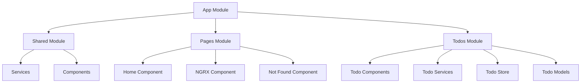

## Application Structure

### Module Organization

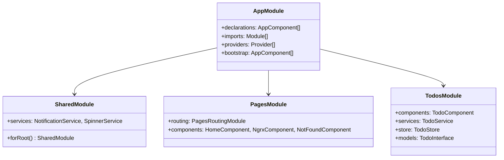

### File Structure Hierarchy

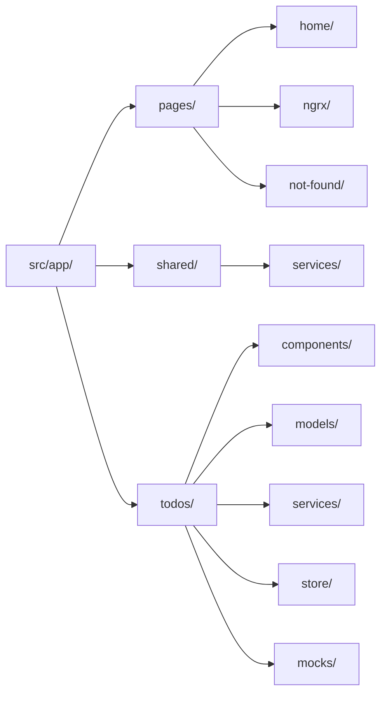

## State Management

The application uses NGRX Signals for reactive state management with a clean separation of concerns.

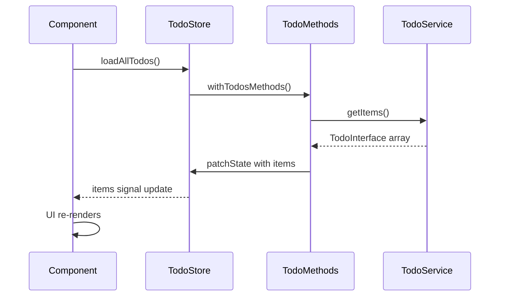

### State Interface

```typescript
interface TodoState {
  items: TodoInterface[];
  currentTodo: Partial<TodoInterface>;
  error: boolean;
  errorMessage: string;
  success: boolean;
  loading: boolean;
}
```

## Routing System

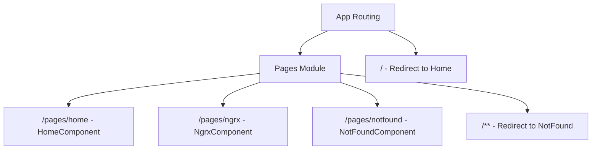

## Component Architecture

### Component Hierarchy

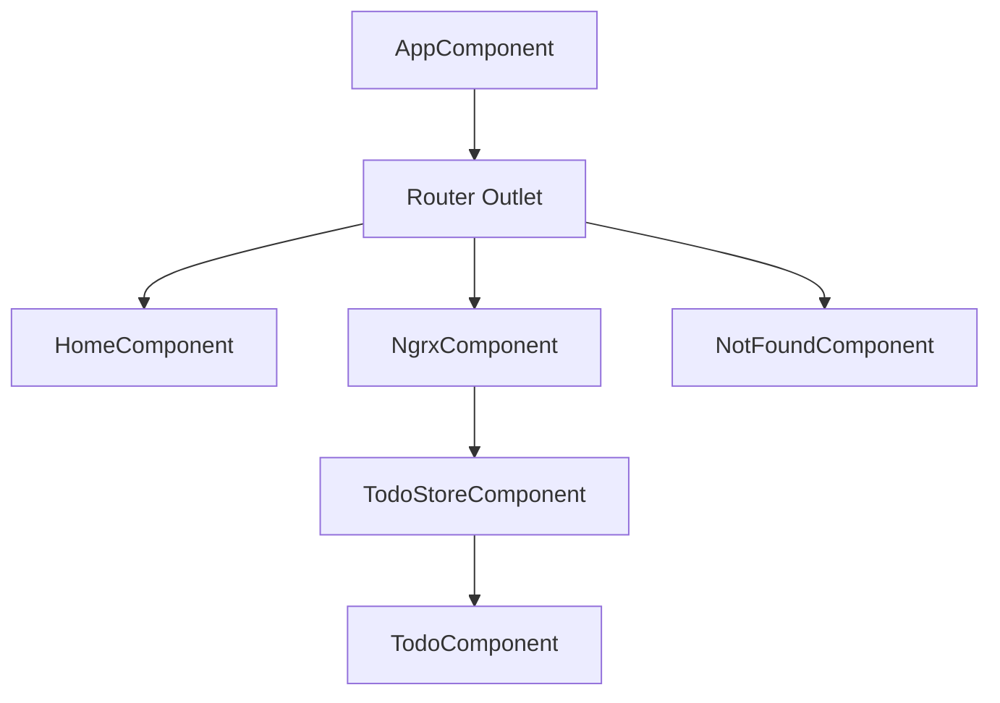

### Component Lifecycle

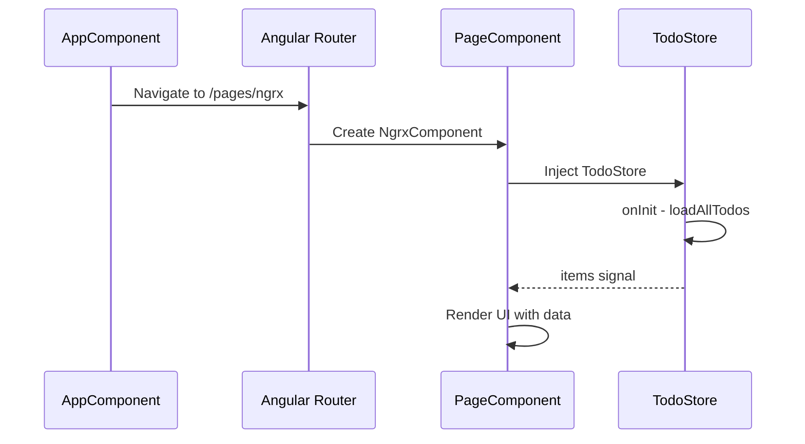

## Services & Data Flow

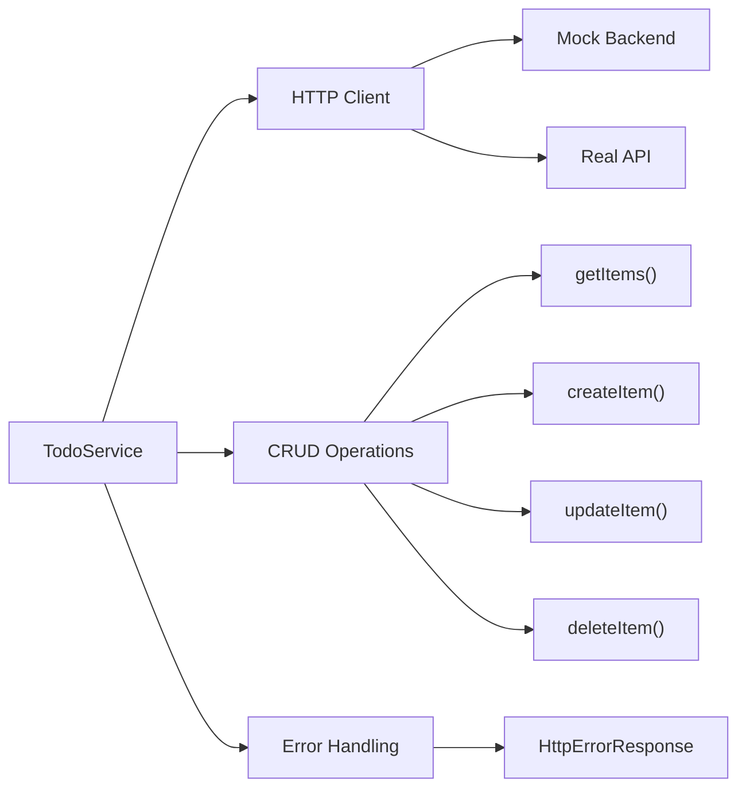

### Service Methods Flow

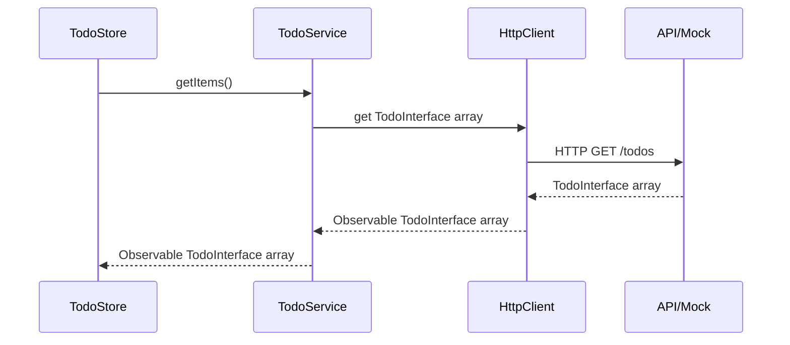

## Testing Strategy

### Test Architecture

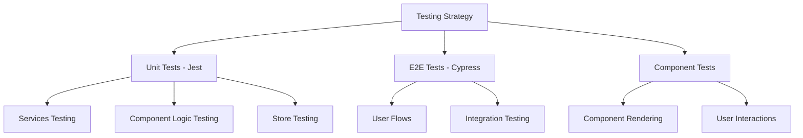

### Test Coverage Areas

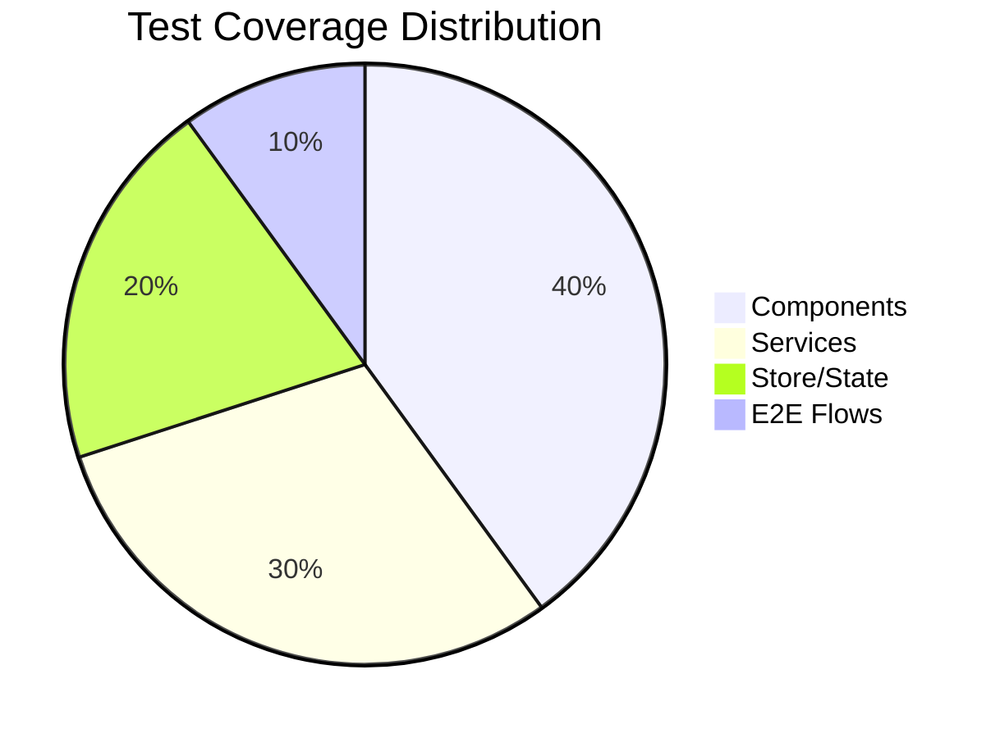

## Data Models

### Entity Relationships

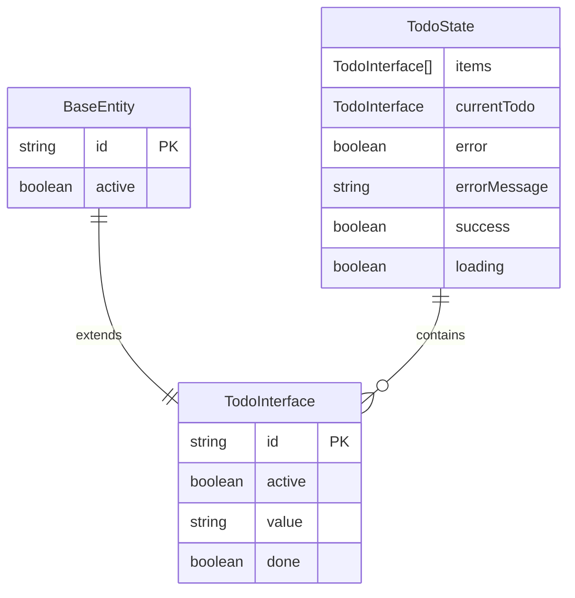

## Performance Considerations

### Optimization Strategy

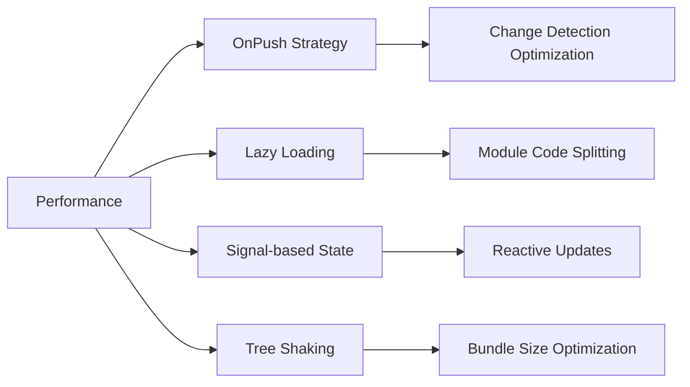

## Development Workflow

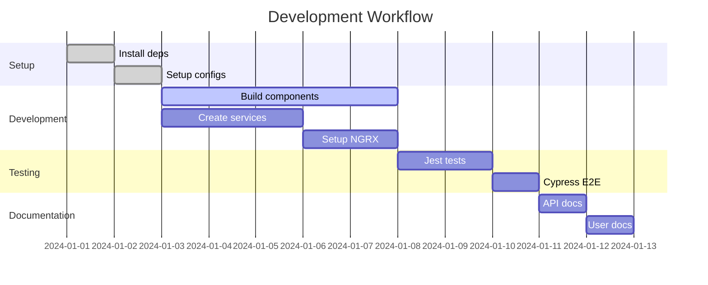

## API Documentation

For detailed API documentation of all classes, interfaces, and methods, please refer to the auto-generated documentation:

📚 **[View Complete API Documentation](api/index.html)**

### Key API Endpoints

| Service | Method | Description |
|---------|--------|-------------|
| TodoService | `getItems()` | Fetch all todo items |
| TodoService | `createItem(todo)` | Create new todo item |
| TodoService | `updateItem(todo)` | Update existing todo item |
| TodoService | `deleteItem(todo)` | Delete todo item |

### Store Selectors

| Selector | Return Type | Description |
|----------|-------------|-------------|
| `items()` | `TodoInterface[]` | All todo items |
| `currentTodo()` | `Partial<TodoInterface>` | Currently selected todo |
| `loading()` | `boolean` | Loading state |
| `error()` | `boolean` | Error state |

---

*This documentation is automatically generated and updated. Last updated: $(date)*