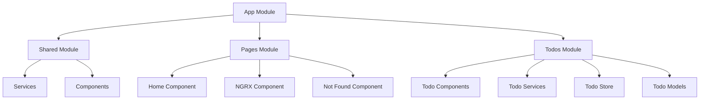
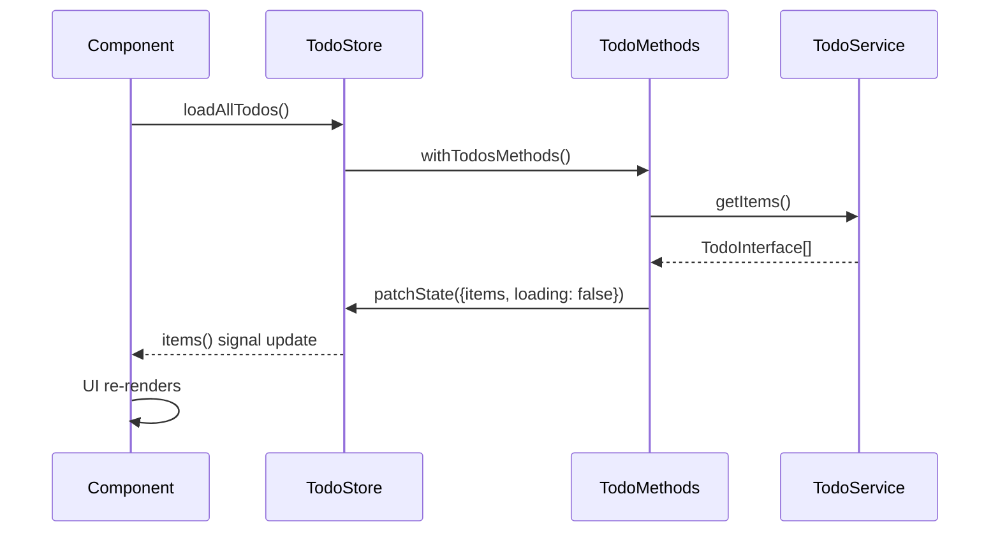
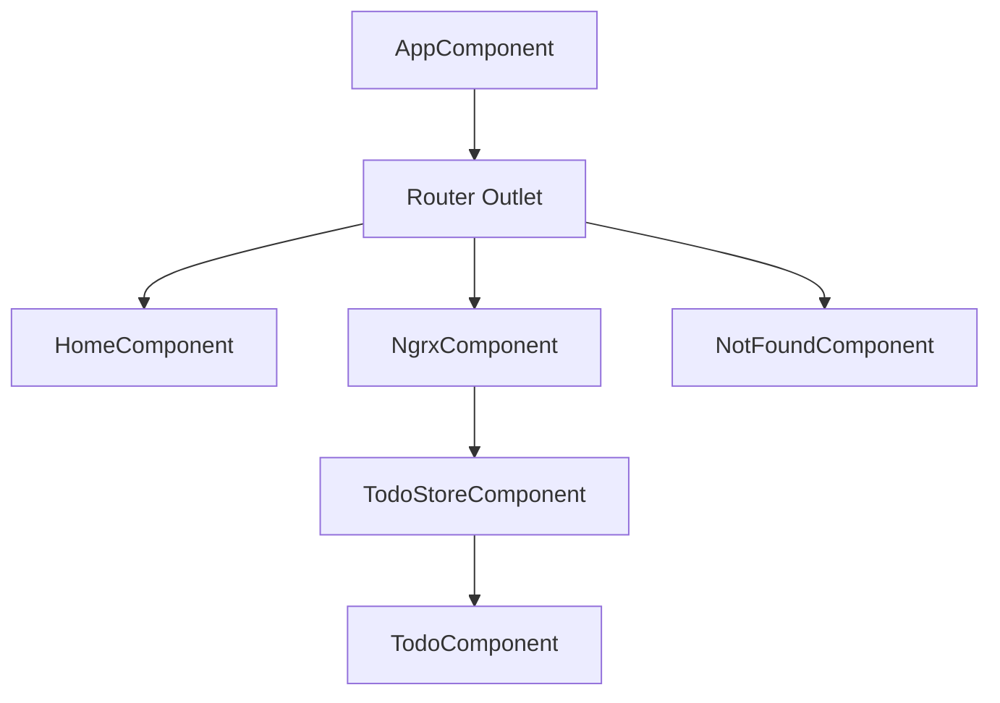
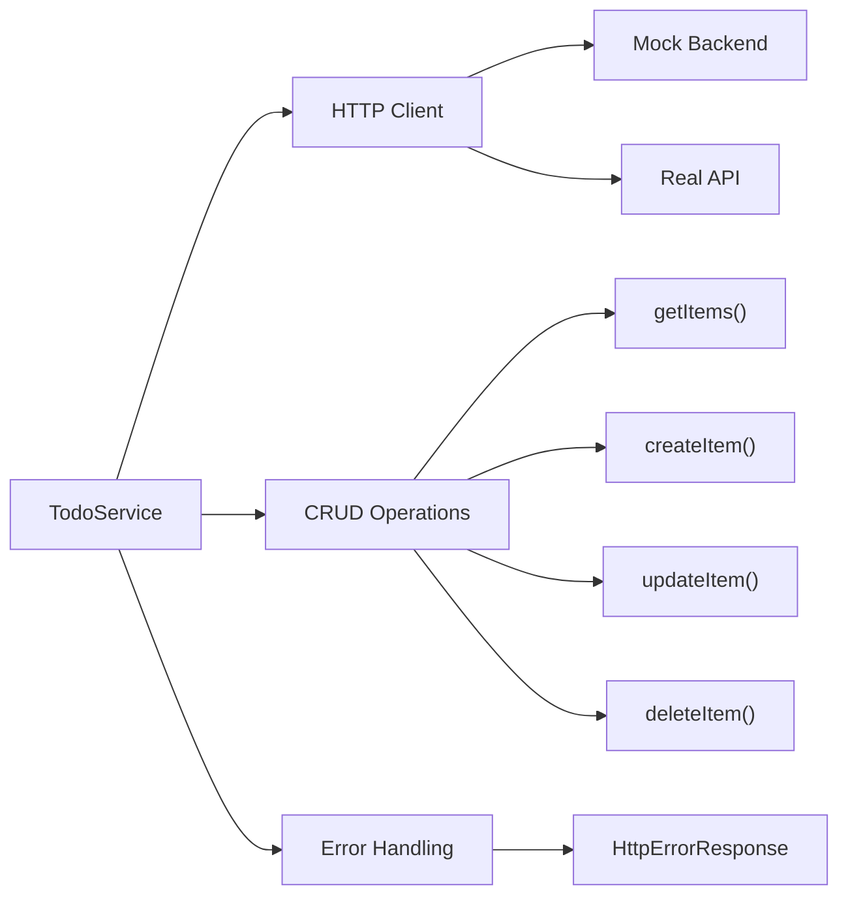
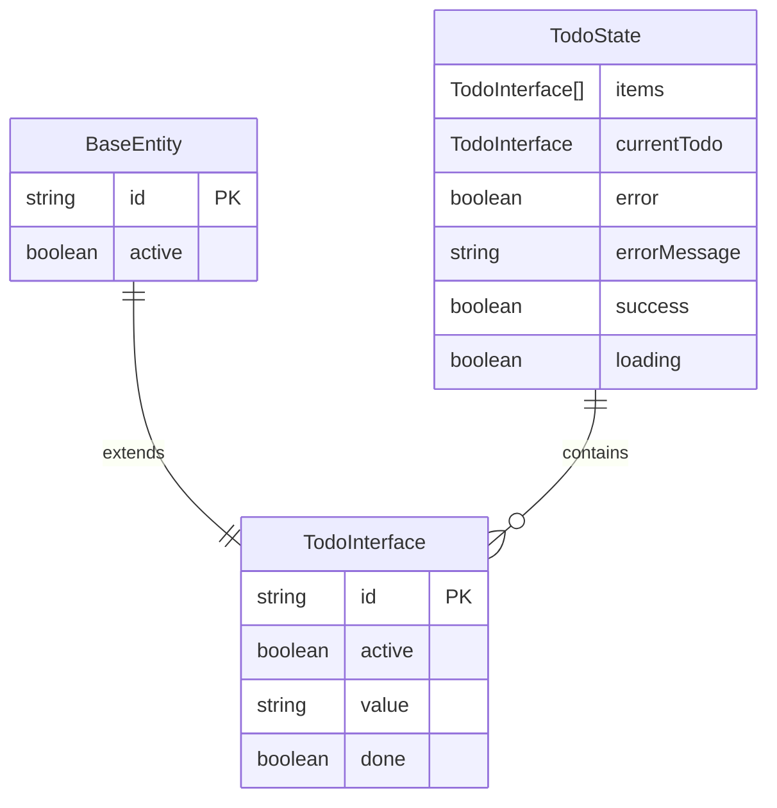
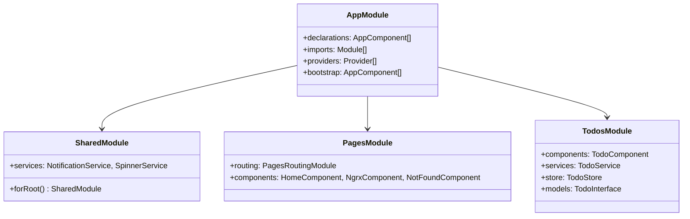

# Application Architecture Diagrams

## Module Dependencies

```mermaid
graph TB
    A[App Module] --> B[Shared Module]
    A --> C[Pages Module]
    A --> D[Todos Module]
    
    B --> E[Services]
    B --> F[Components]
    
    C --> G[Home Component]
    C --> H[NGRX Component]
    C --> I[Not Found Component]
    
    D --> J[Todo Components]
    D --> K[Todo Services]
    D --> L[Todo Store]
    D --> M[Todo Models]
```

## State Management Flow

```mermaid
sequenceDiagram
    participant C as Component
    participant S as TodoStore
    participant M as TodoMethods
    participant API as TodoService
    
    C->>S: loadAllTodos()
    S->>M: withTodosMethods()
    M->>API: getItems()
    API-->>M: TodoInterface[]
    M->>S: patchState({items, loading: false})
    S-->>C: items() signal update
    C->>C: UI re-renders
```

## Component Architecture

```mermaid
graph TB
    A[AppComponent] --> B[Router Outlet]
    B --> C[HomeComponent]
    B --> D[NgrxComponent]
    B --> E[NotFoundComponent]
    
    D --> F[TodoStoreComponent]
    F --> G[TodoComponent]
```

## Data Flow

```mermaid
graph LR
    A[TodoService] --> B[HTTP Client]
    B --> C[Mock Backend]
    B --> D[Real API]
    
    A --> E[CRUD Operations]
    E --> F["getItems()"]
    E --> G["createItem()"]
    E --> H["updateItem()"]
    E --> I["deleteItem()"]
    
    A --> J[Error Handling]
    J --> K[HttpErrorResponse]
```

## Entity Relationships

```mermaid
erDiagram
    BaseEntity {
        string id PK
        boolean active
    }
    
    TodoInterface {
        string id PK
        boolean active
        string value
        boolean done
    }
    
    TodoState {
        TodoInterface[] items
        TodoInterface currentTodo
        boolean error
        string errorMessage
        boolean success
        boolean loading
    }
    
    BaseEntity ||--|| TodoInterface : extends
    TodoState ||--o{ TodoInterface : contains
```

## Class Diagram

```mermaid
classDiagram
    class AppModule {
        +declarations: AppComponent[]
        +imports: Module[]
        +providers: Provider[]
        +bootstrap: AppComponent[]
    }
    
    class SharedModule {
        +forRoot() SharedModule
        +services: NotificationService, SpinnerService
    }
    
    class PagesModule {
        +routing: PagesRoutingModule
        +components: HomeComponent, NgrxComponent, NotFoundComponent
    }
    
    class TodosModule {
        +components: TodoComponent
        +services: TodoService
        +store: TodoStore
        +models: TodoInterface
    }
    
    AppModule --> SharedModule
    AppModule --> PagesModule
    AppModule --> TodosModule
```