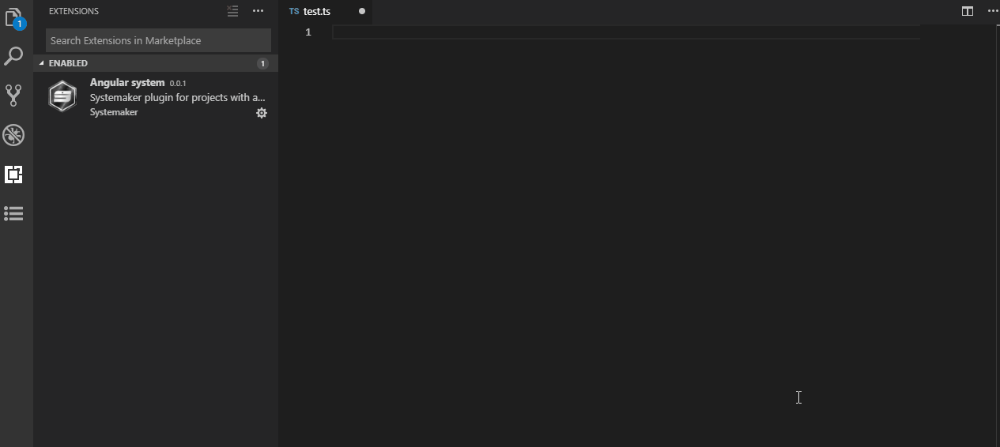

QUICK TESTING
========================================
Snippet guideline for Jasmine framework
----------------------------------------



# Introduction
--------------
* **Context** : As a developer, i want to be able to implement quickly the boring repetitive tasks of covering test in new  added codes.

* **Interest** : Automate code testing to gain time and focus only in business code implementation and regular refactoring.

* **Plan** :  
    1. Setup
    2. Features
    3. Structures
    4. Materials

---

**TABLE OF CONTENTS**

<!-- TOC -->

- [Introduction](#introduction)
- [Setup](#setup)
    - [Unit test](#unit-test)
    - [test snippets](#test-snippets)
    - [e2e test](#e2e-test)
- [Features](#features)
- [Structures](#structures)
    - [Unit test](#unit-test-1)
    - [End-2-end test](#end-2-end-test)
        - [The Page object: *.po.ts](#the-page-object-pots)
        - [The *.e2e-spec.ts](#the-e2e-spects)
        - [Extra : Cucumber syntax (Gherkins)](#extra--cucumber-syntax-gherkins)
- [Materials](#materials)
    - [SimonTest](#simontest)
    - [ngentest](#ngentest)
    - [Angular Typescrit Snippets](#angular-typescrit-snippets)
        - [How to create snippets](#how-to-create-snippets)
            - [JSON Structure of the snippet](#json-structure-of-the-snippet)
            - [Snippets in project](#snippets-in-project)
            - [JSON Escaper](#json-escaper)
            - [Dynamic variables in snippets](#dynamic-variables-in-snippets)
        - [How to use snippets](#how-to-use-snippets)
        - [Unit test snippets](#unit-test-snippets)
            - [Component tests](#component-tests)
                - [sm-test-component](#sm-test-component)
                - [sm-test-component-with-stub-service](#sm-test-component-with-stub-service)
                - [sm-test-component-with-spy-service](#sm-test-component-with-spy-service)
            - [Service tests](#service-tests)
                - [sm-test-service](#sm-test-service)
                - [sm-test-service-with-stub](#sm-test-service-with-stub)
                - [sm-test-service-with-spy](#sm-test-service-with-spy)
            - [Function tests with SpyOn](#function-tests-with-spyon)
                - [sm-test-spyon-methods](#sm-test-spyon-methods)
                - [sm-test-spyon-calls](#sm-test-spyon-calls)
            - [Expect / assertion tests](#expect--assertion-tests)
                - [sm-test-expect-to-be](#sm-test-expect-to-be)
                - [sm-test-expect-to-throw](#sm-test-expect-to-throw)
                - [sm-test-expect-to-contain](#sm-test-expect-to-contain)
                - [sm-test-expect-to-dom-value](#sm-test-expect-to-dom-value)
                - [sm-test-expect-to-dom-event](#sm-test-expect-to-dom-event)
                - [sm-test-expect-to-async-timer](#sm-test-expect-to-async-timer)
                - [sm-test-expect-to-async-observable](#sm-test-expect-to-async-observable)
- [Conclusion](#conclusion)
- [Credits](#credits)

<!-- /TOC -->
---

# Setup
------------

## Unit test

* Generate the unit test 
  * Get the spec file (already generated by Angular CLI):  *.spec.ts
  * Or generate a custom unit test file (with plugin simon test)
    in vsCode editor , Right-click on your Angular component then select "Generate Angular tests" to generate the test file
  * Or generate a custom unit test file (with plugin ngentest); For example, type on terminal `ngentest my.component.ts`


## test snippets
in vsCode editor, type the first letters of any of the snippets test commands :

* Example to generate a test component with a service using stub
```shell
sm-test-component-with-stub-service
```

* Execute your test suite
```shell
ng test
```

## e2e test

* Generate e2e test
  1. Create first the Page object file : *.po.ts
  2. Get the spec file (already done with Angular CLI):  *.e2e-spec.ts

* Execute your test suite
```shell
ng e2e
```


# Features
----------
* Quick understand of the anatomy of tests

* How to write tests for **classes, components, services, directives and pipes**.
    * It should **create**
    * It should **init** (ngOnInit())
    * it should **run** method
    * It should **render** view
    * It should **handle** event
    * It should **destroy** instance (ngOnDetsroy())
* How to write tests using **mocks** and **spys**.
* How to write tests that depend on **change detection**.
* How to write tests that involve an **asynchronous action**.
* How to write tests that involve the **Http service**.
* How to write tests that involve **DOM values and manipulation**
* How to write tests that involve **model driven forms** (template driven forms require E2E testing).
* How to write tests to test the **Router**.
* Which modern professionnal **patterns or generator tools** to use ?


# Structures
------------

## Unit test 
**Anatomy of a Jasmine Test suite**

1. **describe** what your testing. This is your test suite.
2. **it should** have some expected behaviors. These are your **specs**.
3. **expect or assert** these behaviors to hold true. These are your **expectations**
```ts
describe('MyAwesomeComponent', () => {
  beforeEach( () => {
    // reproduce the test state
  })
   
  // spec 
  it('should be awesome', () => {
    // expectation or assertion
    expect(component).toBe(awesome)
  });

  // More specs here

})
```
4. **TestBed and fixture** to simulate angular imports, providers, declarations, etc. and create an instance of a component
```ts
import { async, ComponentFixture, TestBed } from '@angular/core/testing';

import { ExampleComponent } from './example.component';

describe('ExampleComponent', () => {
    let component: ExampleComponent;
    let fixture: ComponentFixture<ExampleComponent>;

    // asynchronous beforeEach
    // reproduce the test state and inject some services
    beforeEach(async(() => {
        TestBed.configureTestingModule({
            declarations: [ ExampleComponent ],
        })
        .compileComponents();
    }));

    // synchronous beforeEach
    // Create an instance of a component fixture through the TestBed
    // A fixture is a wrapper for a component and it’s template.
    beforeEach(() => {
        fixture = TestBed.createComponent(ExampleComponent);
        component = fixture.componentInstance;

        fixture.detectChanges(); // trigger initial data binding
    });

    // spec instance test
    it('should create', () => {
        // expectation or assertion
        expect(component).toBeTruthy();
    });

    
});

```


## End-2-end test 
**Anatomy of a Protractor Test suite**
Unlike the isolated tests we created in the previous section, it will simulate how an end user experiences your app by running it on a web browser. You can click buttons, fill out forms, and iteract with the app in a very natural way.

* The **Page object .po.ts** file is where you define the actual elements from the DOM that you want to interact with or test. You can grab elements by their CSS class, ID, or tag name, then you can test their content or interact with them.


### The Page object: *.po.ts 
```ts
// app.po.ts
import { browser, by, element } from 'protractor';

export class AppPage {
  navigateTo() {
    return browser.get('/');
  }

  get title() {
    return element(by.css('app-root h1')).getText();
  }

  get toggleButton() {
    return element(by.tagName('button'));
  }

  get alertMessage() {
    const el = element(by.className('message-body'));
    return el ? el.getText() : null;
  }
}
```

### The *.e2e-spec.ts
the Jasmine test format is almost identical to the the unit tests we wrote earlier.
```ts
// app.e2e-spec.ts
import { AppPage } from './app.po';

describe('My Awesome App', () => {
  let page: AppPage;

  beforeEach(() => {
    page = new AppPage();
    page.navigateTo();
  });

  it('should display welcome message', () => {
    expect(page.title).toEqual('Alert Button');
  });

  it('should not display the alert message', () => {
    expect(page.alertMessage).toBeFalsy();
  });

  it('should display the alert message after clicking toggle button', () => {
    const btn = page.toggleButton;
    let content = page.alertMessage;

    expect(btn).toBeDefined();  
    expect(content).toBeFalsy();  
    
    btn.click();

    content = page.alertMessage;
    expect(content).toContain('warn');  
  
  });
});
```


### Extra : Cucumber syntax (Gherkins)
Features, scenarios, steps (Given, When, Then, And, But, Before)
source : https://medium.com/spektrakel-blog/angular-protractor-and-cucumber-552bd75ff6c9


# Materials
-----------
Tools and/or Snippets
Which modern professionnal **patterns and/or generator tools** to use ?

## SimonTest
It analyzes your code and creates the necessary stubs, configures the TestBed, and it even generates basic tests.
[https://marketplace.visualstudio.com/items?itemName=SimonTest.simontest](https://marketplace.visualstudio.com/items?itemName=SimonTest.simontest)

**How-to:** Assuming you coded your component, and you want to write a test

in vsCode editor , Right-click on your Angular component then select "Generate Angular tests" to generate the test file

**Example:** 
after a right-click on app/components/login.component.ts to generate the test file login.component.gen.spec.ts

```ts
import { ComponentFixture, TestBed } from "@angular/core/testing";
import { NO_ERRORS_SCHEMA } from "@angular/core";
import { NgZone } from "@angular/core";
import { NgForm } from "@angular/forms";
import { Router } from "@angular/router";
import { TranslatePipe } from "@ngx-translate/core";
import { AlertService } from "@app/core/services/alert.service";
import { AuthService } from "@app/core/services/auth/auth.service";
import { LocalStorageService } from "@app/core/services/local-storage.service";
import { MiscService } from "@app/core/services/misc.service";
import { LoginComponent } from "./login.component";
describe("LoginComponent", () => {
  let component: LoginComponent;
  let fixture: ComponentFixture<LoginComponent>;
  beforeEach(() => {
    const ngZoneStub = { run: () => ({}) };
    const ngFormStub = { valid: {}, value: { username: {} } };
    const routerStub = { navigateByUrl: () => ({}) };
    const translatePipeStub = { transform: () => ({}) };
    const alertServiceStub = { error: () => ({}), success: () => ({}) };
    const authServiceStub = {
      isLoggedIn: () => ({ pipe: () => ({ subscribe: () => ({}) }) }),
      attemptLogin: () => ({ subscribe: () => ({}) }),
      resetPassword: () => ({ subscribe: () => ({}) }),
      user: { onBoardDate: {} },
      redirectUrl: {}
    };
    const localStorageServiceStub = { get: () => ({}), store: () => ({}) };
    const miscServiceStub = { getHealth: () => ({ subscribe: () => ({}) }) };
    TestBed.configureTestingModule({
      schemas: [NO_ERRORS_SCHEMA],
      declarations: [LoginComponent],
      providers: [
        { provide: NgZone, useValue: ngZoneStub },
        { provide: NgForm, useValue: ngFormStub },
        { provide: Router, useValue: routerStub },
        { provide: TranslatePipe, useValue: translatePipeStub },
        { provide: AlertService, useValue: alertServiceStub },
        { provide: AuthService, useValue: authServiceStub },
        { provide: LocalStorageService, useValue: localStorageServiceStub },
        { provide: MiscService, useValue: miscServiceStub }
      ]
    });
    fixture = TestBed.createComponent(LoginComponent);
    component = fixture.componentInstance;
  });
  it("can load instance", () => {
    expect(component).toBeTruthy();
  });
  it("forgotPassword defaults to: false", () => {
    expect(component.forgotPassword).toEqual(false);
  });
  it("isLogging defaults to: false", () => {
    expect(component.isLogging).toEqual(false);
  });
  it("offline defaults to: false", () => {
    expect(component.offline).toEqual(false);
  });
  it("hasModernBrowser defaults to: true", () => {
    expect(component.hasModernBrowser).toEqual(true);
  });
  it("closeModernBrowserWarning defaults to: false", () => {
    expect(component.closeModernBrowserWarning).toEqual(false);
  });
  it("closeCookiesPolicyWarning defaults to: false", () => {
    expect(component.closeCookiesPolicyWarning).toEqual(false);
  });
  describe("onLogin", () => {
    it("makes expected calls", () => {
      const alertServiceStub: AlertService = fixture.debugElement.injector.get(
        AlertService
      );
      const authServiceStub: AuthService = fixture.debugElement.injector.get(
        AuthService
      );
      spyOn(alertServiceStub, "error");
      spyOn(authServiceStub, "attemptLogin");
      component.onLogin(ngFormStub);
      expect(alertServiceStub.error).toHaveBeenCalled();
      expect(authServiceStub.attemptLogin).toHaveBeenCalled();
    });
  });
  describe("onReset", () => {
    it("makes expected calls", () => {
      const translatePipeStub: TranslatePipe = fixture.debugElement.injector.get(
        TranslatePipe
      );
      const alertServiceStub: AlertService = fixture.debugElement.injector.get(
        AlertService
      );
      const authServiceStub: AuthService = fixture.debugElement.injector.get(
        AuthService
      );
      spyOn(translatePipeStub, "transform");
      spyOn(alertServiceStub, "error");
      spyOn(alertServiceStub, "success");
      spyOn(authServiceStub, "resetPassword");
      component.onReset(ngFormStub);
      expect(translatePipeStub.transform).toHaveBeenCalled();
      expect(alertServiceStub.error).toHaveBeenCalled();
      expect(alertServiceStub.success).toHaveBeenCalled();
      expect(authServiceStub.resetPassword).toHaveBeenCalled();
    });
  });
  describe("ngOnInit", () => {
    it("makes expected calls", () => {
      const authServiceStub: AuthService = fixture.debugElement.injector.get(
        AuthService
      );
      const localStorageServiceStub: LocalStorageService = fixture.debugElement.injector.get(
        LocalStorageService
      );
      spyOn(component, "checkUp");
      spyOn(authServiceStub, "isLoggedIn");
      spyOn(localStorageServiceStub, "get");
      component.ngOnInit();
      expect(component.checkUp).toHaveBeenCalled();
      expect(authServiceStub.isLoggedIn).toHaveBeenCalled();
      expect(localStorageServiceStub.get).toHaveBeenCalled();
    });
  });
  describe("checkUp", () => {
    it("makes expected calls", () => {
      const miscServiceStub: MiscService = fixture.debugElement.injector.get(
        MiscService
      );
      spyOn(miscServiceStub, "getHealth");
      component.checkUp();
      expect(miscServiceStub.getHealth).toHaveBeenCalled();
    });
  });
});

```


## ngentest
Angular5+ Unit Test Generator For Components, Directive, Services, and Pipes
[https://github.com/allenhwkim/ngentest](https://github.com/allenhwkim/ngentest)

**How-to:** Assuming you coded your component, and you want to write a test
```shell
$ npm install ngentest -g # to run this command anywhere
$ ngentest my.component.ts # node_modules/.bin/gentest
```

**Example:** 
```shell
ngentest login.component.ts
```
then you will get this log information in the console : 

```ts
import { async, ComponentFixture, TestBed } from '@angular/core/testing';
import { Injectable, CUSTOM_ELEMENTS_SCHEMA } from '@angular/core';
import { isPlatformBrowser } from '@angular/common';
import { By } from '@angular/platform-browser';
import { Observable } from 'rxjs/Observable';
import 'rxjs/add/observable/of';
import 'rxjs/add/observable/throw';

import {Component, Directive, NgZone} from '@angular/core';
import {LoginComponent} from './login.component';
import {AlertService} from '@app/core/services/alert.service';
import {AuthService} from '@app/core/services/auth/auth.service';
import {MiscService} from '@app/core/services/misc.service';
import {Router} from '@angular/router';
import {TranslatePipe} from '@ngx-translate/core';
import {LocalStorageService} from '@app/core/services/local-storage.service';

@Injectable();
class MockRouter { navigate = jest.fn(); }

describe('LoginComponent', () => {
  let fixture;
  let component;

  beforeEach(() => {
    TestBed.configureTestingModule({
      declarations: [
        LoginComponent
      ],
      providers: [
        AlertService,
        AuthService,
        MiscService,
        {provide: Router, useClass: MockRouter},
        NgZone,
        TranslatePipe,
        LocalStorageService,
      ],
      schemas: [ CUSTOM_ELEMENTS_SCHEMA ]
    }).compileComponents();
    fixture = TestBed.createComponent(LoginComponent);
    component = fixture.debugElement.componentInstance;
  });

  it('should create a component', async () => {
    expect(component).toBeTruthy();
  });


  it('should run #ngOnInit()', async () => {
    // const result = component.ngOnInit();
  });

  it('should run #ngOnDestroy()', async () => {
    // const result = component.ngOnDestroy();
  });

  it('should run #checkUp()', async () => {
    // const result = component.checkUp();
  });

  it('should run #onLogin()', async () => {
    // const result = component.onLogin(form);
  });

  it('should run #onReset()', async () => {
    // const result = component.onReset(form);
  });

  it('should run #redirect()', async () => {
    // const result = component.redirect();
  });

  it('should run #closePolicy()', async () => {
    // const result = component.closePolicy();
  });

});
```

## Angular Typescrit Snippets
A collection of code snippets bringing recipes for each type of common in Angular 2 framework.
It follows as close as possible the standards recommended in [](https://angular.io/docs/ts/latest/guide/testing.html) 

### How to create snippets
you can use the extension **Snippets in project** to create your own snippets and it will be added in a new folder called snippets in your project.

#### JSON Structure of the snippet

Place your global snippets in json file . 
Each snippet is defined under a snippet name and has a scope, prefix, body and description. Add comma separated ids of the languages where the snippet is applicable in the scope field. If scope is left empty or omitted, the snippet gets applied to all languages. 
The prefix is what is used to trigger the snippet and the body will be expanded and inserted. Possible variables are: 
  * $1, $2 for tab stops, 
  * $0 for the final cursor position, 
  * and ${1:label}, ${2:another} for placeholders. Placeholders with the same ids are connected.

Example:

```json
"Print to console": {
	"scope": "javascript,typescript",
	"prefix": "log",
	"body": [
		"console.debug('$1');",
		"$2"
	],
	"description": "Log output to console"
}
```

#### Snippets in project
Create snippet base your project dir & Insert snippet outside
[https://marketplace.visualstudio.com/items?itemName=jock.snippets-project](https://marketplace.visualstudio.com/items?itemName=jock.snippets-project)


#### JSON Escaper
usefull for option selection ( in this case think about escaping also "|" with "\\|")
[https://marketplace.visualstudio.com/items?itemName=joshuapoehls.json-escaper](https://marketplace.visualstudio.com/items?itemName=joshuapoehls.json-escaper)


#### Dynamic variables in snippets
* Default variable name
```json
"    selector: 'app-${2:componentName}',",
```

* Auto fill variable name by folder or file name with constants, regular expression and functions
```json
"    selector: 'app-${2:${componentName:${TM_FILENAME/([a-z]*).([a-z]*)/${1:/capitalize}/g}}}',",
```

* Reuse dynamic variable name
```json
"import { ${2}Service } from './${2}.service';",
"import { I${2}Model } from './I${2}Model.model';",
```
* Option selection (you can use here the extension **Json escaper** for multiple lines codes )
```json
"    test: ${4|expect.toBeTruphy();,expect.toBeFalsy();\n    HelloWorld;,expect.toBeFalsy();|}",
```

### How to use snippets 
in vsCode editor, type the first letters of any of snippet test commands :

**Example:** 
```ts
sm-test-component
```

```ts
import { async, ComponentFixture, TestBed } from '@angular/core/testing';

import { NameComponent } from './name.component';

describe('NameComponent', () => {
    let component: NameComponent;
    let fixture: ComponentFixture<NameComponent>;

    // asynchronous beforeEach
    // reproduce the test state and inject services
    beforeEach(async(() => {
        TestBed.configureTestingModule({
        declarations: [ NameComponent ],
        providers: [ { provide: NameService, useValue: NameServiceStub } ]
        })
        .compileComponents();
    }));


    // synchronous beforeEach
    // Create an instance of a component fixture through the TestBed
    // A fixture is a wrapper for a component and it’s template.
    beforeEach(() => {
        fixture = TestBed.createComponent(NameComponent);
        component = fixture.componentInstance;

        // NameService provided to the TestBed
        // We can get resolve dependencies using the TestBed injector by using the get function.
        nameService = TestBed.get(NameService);

        fixture.detectChanges(); // trigger initial data binding
    });


    // spec instance test
    it('should create', () => {
        // expectation or assertion
        expect(component).toBeDefined();
    });

    // spec html element test
    it('should find the <p> with fixture.debugElement.nativeElement)', () => {
        const NameElement: HTMLElement = fixture.debugElement.nativeElement;
        const p = NameElement.querySelector('p');
        expect(p.textContent).toEqual('banner works!');
    });

});
```

### Unit test snippets
Frequent test methods (for unit and e2e)

#### Component tests
##### sm-test-component
```ts
import { async, ComponentFixture, TestBed } from '@angular/core/testing';

import { ExampleComponent } from './example.component';

describe('ExampleComponent', () => {
    let component: ExampleComponent;
    let fixture: ComponentFixture<ExampleComponent>;

    // asynchronous beforeEach
    // reproduce the test state and inject some services
    beforeEach(async(() => {
        TestBed.configureTestingModule({
            declarations: [ ExampleComponent ],
        })
        .compileComponents();
    }));

    // synchronous beforeEach
    // Create an instance of a component fixture through the TestBed
    // A fixture is a wrapper for a component and it’s template.
    beforeEach(() => {
        fixture = TestBed.createComponent(ExampleComponent);
        component = fixture.componentInstance;

        fixture.detectChanges(); // trigger initial data binding
    });

    // spec instance test
    it('should create', () => {
        // expectation or assertion
        expect(component).toBeTruthy();
    });

    
});
```
##### sm-test-component-with-stub-service
Use and fake a Service with a Stub
```ts
import { async, ComponentFixture, TestBed } from '@angular/core/testing';
import { of } from 'rxjs/observable/of';

import { ExampleComponent } from './example.component';
import { ExampleService } from '.example.service';

describe('ExampleComponent', () => {
    let component: ExampleComponent;
    let fixture: ComponentFixture<ExampleComponent>;

    // asynchronous beforeEach
    // reproduce the test state and inject services
    beforeEach(async(() => {
        // Stub service with of method to return an observable
        const ExampleServiceStub = {
          getContent: () => of('You have been warned'),
        };

        TestBed.configureTestingModule({
          declarations: [ ExampleComponent ],
          providers: [ { provide: ExampleService, useValue: ExampleServiceStub } ]
        })
        .compileComponents();
    }));

    // synchronous beforeEach
    // Create an instance of a component fixture through the TestBed
    // A fixture is a wrapper for a component and it’s template.
    beforeEach(() => {
      fixture = TestBed.createComponent(ExampleComponent);
      component = fixture.componentInstance;

      // ExampleService instancied by the TestBed
      // We can get resolve dependencies using the TestBed injector by using the get function.
      exampleService = TestBed.get(ExampleService);

      fixture.detectChanges(); // trigger initial data binding
    });

    // spec instance test
    it('should create', () => {
      // expectation or assertion
      expect(component).toBeTruthy();
    });

    
});
```

##### sm-test-component-with-spy-service
Use and fake a Service with a Spy


```ts
import { async, ComponentFixture, TestBed } from '@angular/core/testing';
import { of } from 'rxjs/observable/of';

import { ExampleComponent } from './example.component';
import { ExampleService } from '.example.service';

describe('ExampleComponent', () => {
    let component: ExampleComponent;
    let fixture: ComponentFixture<ExampleComponent>;
    let service: ExampleService;
    let spyService: jasmine.Spy;

    // asynchronous beforeEach
    // reproduce the test state and inject services
    beforeEach(async(() => {
        TestBed.configureTestingModule({
            declarations: [ ExampleComponent ],
            providers: [ ExampleService ]
        })
        .compileComponents();
    }));

    // synchronous beforeEach
    // Create an instance of a component fixture through the TestBed
    // A fixture is a wrapper for a component and it’s template.
    beforeEach(() => {
        fixture = TestBed.createComponent(ExampleComponent);
        component = fixture.componentInstance;

        // ExampleService instancied by the TestBed
        // We can get resolve dependencies using the TestBed injector by using the get function.
        service = TestBed.get(ExampleService);
        // spy service with of method to return an observable
        spyService = spyOn(service, 'getContent').and.returnValue(of('message'));

        fixture.detectChanges(); // trigger initial data binding
    });

    // spec instance test
    it('should create', () => {
        // expectation or assertion
        expect(component).toBeTruthy();
    });

    
});
```
#### Service tests

##### sm-test-service
Classic test service
```ts
import { async, TestBed } from '@angular/core/testing';
import { of } from 'rxjs/observable/of';

import { ExampleService } from './example.service';

describe('ExampleService', () => {
    let service: ExampleService;

    // asynchronous beforeEach
    // reproduce the test state and inject services
    beforeEach(async(() => {
        TestBed.configureTestingModule({
           providers: [ 
               ExampleService, 
            ]
        });
    }));

    // synchronous beforeEach
    // Create an instance of a component fixture through the TestBed
    beforeEach(() => {
      // ExampleService instancied by the TestBed
      // We can get resolve dependencies using the TestBed injector by using the get function.
      service = TestBed.get(ExampleService);
    });

  it('should be created', () => {
    expect(service).toBeTruthy();
  });
});

```
##### sm-test-service-with-stub
Use stub in a service
```ts
import { async, TestBed } from '@angular/core/testing';
import { of } from 'rxjs/observable/of';

import { ExampleService } from './example.service';
import { AnotherExampleService } from './anotherExample.service';

describe('ExampleService', () => {
    let service: ExampleService;
    let anotherService: AnotherExampleService;

    // asynchronous beforeEach
    // reproduce the test state and inject services
    beforeEach(async(() => {
        // Stub service with of method to return an observable
        const AnotherExampleServiceStub = {
          getContent: () => of('You have been warned'),
        };

        TestBed.configureTestingModule({
           providers: [ 
               { provide: AnotherExampleService, useValue: AnotherExampleServiceStub },
               ExampleService, 
            ]
        });
    }));

    // synchronous beforeEach
    // Create an instance of a component fixture through the TestBed
    beforeEach(() => {
      // ExampleService instancied by the TestBed
      // We can get resolve dependencies using the TestBed injector by using the get function.
      service = TestBed.get(ExampleService);
      anotherService = TestBed.get(AnotherExampleService);
    });

  it('should be created', () => {
    expect(service).toBeTruthy();
    expect(anotherService).toBeTruthy();
  });
});

```
##### sm-test-service-with-spy
Use spy in a service
```ts
import { async, TestBed } from '@angular/core/testing';
import { of } from 'rxjs/observable/of';

import { ExampleService } from './example.service';
import { AnotherExampleService } from './anotherExample.service';

describe('ExampleService', () => {
    let spyService: jasmine.Spy;
    let service: ExampleService;
    let anotherService: AnotherExampleService;

    // asynchronous beforeEach
    // reproduce the test state and inject services
    beforeEach(async(() => {
        // Stub service with of method to return an observable
        const AnotherExampleServiceStub = {
          getContent: () => of('You have been warned'),
        };

        TestBed.configureTestingModule({
           providers: [ 
               { provide: AnotherExampleService, useValue: AnotherExampleServiceStub },
               ExampleService, 
            ]
        });
    }));

    // synchronous beforeEach
    // Create an instance of a component fixture through the TestBed
    beforeEach(() => {
      // ExampleService instancied by the TestBed
      // We can get resolve dependencies using the TestBed injector by using the get function.
      service = TestBed.get(ExampleService);
      anotherService = TestBed.get(AnotherExampleService);
      // spy service with of method to return an observable
      spyService = spyOn(service, 'getContent').and.returnValue(of('message'));
    });

  it('should be created', () => {
    expect(service).toBeTruthy();
    expect(anotherService).toBeTruthy();
  });
});

```

#### Function tests with SpyOn

##### sm-test-spyon-methods
SpyOn an object methods to modify its behaviors
* A quick dropdown list of choice :
  * and-callThrough
  * and-returnValue
  * and-callFake
  * and-throwError
  * and-stub


* Spy on an existing method and Call through to the original
```ts
spyOn(obj, 'method').and.callThrough();
```

* Or Return a specified value
```ts
spyOn(obj, 'method').and.returnValue(any-specific-value);
```

* Or Call the given function instead of the real one
```ts
spyOn(obj, 'method').and.callFake(function(arguments, can, be, received) {
  return 1001;
});

spyOn(obj, 'method').and.callFake(
  (hero: Hero) => { Object.assign(this.testHero, hero)
});
```

* Or Throw an error
```ts
spyOn(obj, 'method').and.throwError("quux");
```

* Or Reset to default stubbing behavior (resets the operations above)
```ts
spyOn(obj, 'method').and.stub();
```


##### sm-test-spyon-calls
SpyOn object methods to check its calls
* A quick dropdown list of choice :
  * calls-any
  * calls-count
  * calls-first
  * calls-most-recent
  * calls-all
  * calls-reset 

* Returns true if any calls have been made 
```ts
spyOn(obj, 'method').calls.any();
```

* Returns the number of times the spy got called 
```ts
spyOn(obj, 'method').calls.count();
```

* Returns the first call’s context and arguments  in an object like this :
```ts
{
  object: {...},  // 'this' object
  args: []        // array of arguments
}
```

```ts
spyOn(obj, 'method').calls.first();
```

* Returns the most recent call’s context and arguments in an object like this :
```ts
{
  object: {...},  // 'this' object
  args: []        // array of arguments
}
```

```ts
spyOn(obj, 'method').calls.mostRecent();
```

* Returns array of context and arguments passed to each call in an array like this: 
```ts
[
  {
    object: {...},  // 'this' object
    args: [...]     // array of arguments
  },  
  ...               // one object for each call
]
```

```ts
spyOn(obj, 'method').calls.all();
```

* Reset the call tracker 
After calling reset(), any() will be false, count() will be 0, etc.
```ts
spyOn(obj, 'method').calls.reset();
```

#### Expect / assertion tests

##### sm-test-expect-to-be
A quick dropdown list of choice :
  * toHaveBeenCalled()
  * toBe()
  * toBeTruthy()
  * toBeFalsy()
  * toBeDefined()
  * toBeUndefined()
  * not.toBeUndefined()     
  * toBeNull()
  * not.toBeNull()
  * toEqual()
  * toBeGreaterThan()
  * toBeLessThan()
  * toBeLessThanOrEqual()
  * toBeGreaterThanOrEqual()
  


```ts
expect(component.getContent).toHaveBeenCalled();
expect(component).toBeTruthy();
expect(component.status).toBeFalsy();

expect(a.foo).toBeDefined();
expect(a.bar).toBeUndefined();
expect(a.foo).not.toBeUndefined();
expect(a).toBeNull();
expect(foo).not.toBeNull();

expect(component.severity).toBe(423);
expect(component.severity).toEqual(true);
expect(component.setBar()).toEqual({object: foo, args: [456, "baz"]});
expect(component.severity).toBeGreaterThan(2);
expect(component.severity).toBeLessThan(3);
expect(component.severity).toBeGreaterThanOrEqual(3);
```


##### sm-test-expect-to-throw
for testing if a function throws an exception.
A quick dropdown list of choice :
  * toThrow()
  * toThrowError()

```ts
expect(foo).not.toThrow();
expect(bar).toThrow();
expect(baz).toThrow('what');

expect(foo).toThrowError("foo bar baz");
expect(foo).toThrowError(TypeError);
expect(foo).toThrowError(TypeError, "foo bar baz");
```

##### sm-test-expect-to-contain 
A quick dropdown list of choice :
  * toContain()
  * toMatch()
```ts
expect(component.content).toContain('warn');
// with Regex
expect(component.message).toMatch(/string$/);
```


##### sm-test-expect-to-dom-value
Expect to get value from DOM element
The DebugElement makes it possible to query DOM elements in the component tempate to ensure they are rendered properly.

```ts

// 1. Create an instance of `NumberComponent`
const fixture = TestBed.createComponent(NumberComponent);

// 2. Set its `@Input() value: number` property
fixture.componentInstance.value = 12;

// 3. Render the component to DOM
fixture.changeDetectorRef.detectChanges();

// 4. Verify that rendering produced the expected result
expect(fixture.debugElement.nativeElement.querySelector('p').textContent).toEqual('Hello world!');

expect(fixture.debugElement.nativeElement.querySelector('input').value).toEqual('12');

expect(fixture.debugElement.query(By.css('h1')).nativeElement.innerText).toBe('Alert Button');

```
##### sm-test-expect-to-dom-event
Expect to manipulate and trigger DOM element
Don't forget to use **fakeAsync** for async operations
```ts
it(`emits the selected value`, fakeAsync(() => {
    // 1. Create an instance of `NumberComponent`
    const fixture = TestBed.createComponent(NumberComponent);
   
    // 2. Subscribe to its `@Output() onValueChanges: EventEmitter<number>`
    fixture.componentInstance.onValueChanges.subscribe((value: number) => {
        // 4. Verify that the event has expected payload
        expect(value).toBe(7);
    });

    // 3a. Manipulate the component's DOM tree and...
    const input = fixture.nativeElement.querySelector('input');
    input.value = 7;

    // 3b. ..trigger a faked user-input event
    input.dispatchEvent(new Event('change'));
    tick(); // XX: make sure to call `tick()` for event processing

}));
```

##### sm-test-expect-to-async-timer
Expect Async operation with a timer
1. Add a fake async zone, 
2. Then using tick() with the number of miliseconds to simulate the passage of time.

```ts
// Async
it('should toggle the message boolean asynchronously', fakeAsync(() => {
expect(component.hideContent).toBeTruthy();
component.toggle();
// tick(499); // fails
tick(500);   // passes
expect(component.hideContent).toBeFalsy();
}));
```


Optional : Use the Rxjs Timer to fake aync activity

```ts
// alert-message.component.ts
import { timer } from 'rxjs/observable/timer';

// wait 500ms before changing the variable value
toggleAsync() {
timer(500).subscribe(() => {
    this.toggle();
});
}
```

##### sm-test-expect-to-async-observable
Expect Async operation with an Observable
1. Add a fake async zone, 
2. Then use the component subscribing method.

```ts
it('should have message content defined from an observable', fakeAsync(() => {

  component.content.subscribe(content => {
    expect(content).toBe('You have been warned');
  });
  
}));
```


# Conclusion
------------
**Tools & Materials mix** : 
1. First use **template generator tool** based on your existing code
2. Second complete if needed with **short snippets** (based on standards and good practices) wrapped and sorted in an automatic dropdown list 

3. Then Customize **namespace variables and return values**

The same approach can be done later for other procedures

# Credits
---------
* Angular Firebase : [https://angularfirebase.com/lessons/angular-testing-guide-including-firebase/#1-Is-something-truthy-or-falsey](https://angularfirebase.com/lessons/angular-testing-guide-including-firebase/#1-Is-something-truthy-or-falsey)

* Angular Testing Snippets: Component :[https://medium.com/spektrakel-blog/angular-testing-snippets-component-1-ffdc67bddeb2](https://medium.com/spektrakel-blog/angular-testing-snippets-component-1-ffdc67bddeb2)

