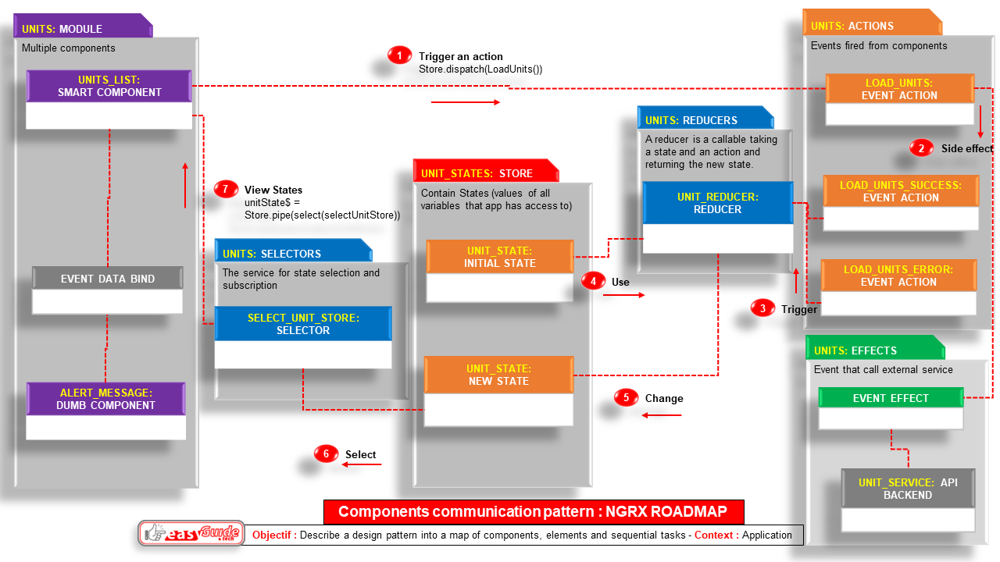

NGRX Guideline
========================================
Guideline for the components communication pattern NGRX
----------------------------------------

<!-- TOC -->

- [1. NGRX Life cycle : Roadmap pattern](#1-ngrx-life-cycle--roadmap-pattern)
    - [Phase 0: The store add a new state as a new shared global variable](#phase-0-the-store-add-a-new-state-as-a-new-shared-global-variable)
    - [Phase 1 : The smart component trigger an action](#phase-1--the-smart-component-trigger-an-action)
    - [Phase 2 : The action add a side effect which call a service](#phase-2--the-action-add-a-side-effect-which-call-a-service)
    - [Phase 3 : The action result (success or error) trigger The reducer to change the states in the store](#phase-3--the-action-result-success-or-error-trigger-the-reducer-to-change-the-states-in-the-store)
    - [Phase 4 : The selector select a state for the smart component](#phase-4--the-selector-select-a-state-for-the-smart-component)
    - [Phase 5 : The smart component share the selected state with the dumb components](#phase-5--the-smart-component-share-the-selected-state-with-the-dumb-components)

<!-- /TOC -->


---
# 1. NGRX Life cycle : Roadmap pattern
---


---

---


## Phase 0: The store add a new state as a new shared global variable
---
* `src/store/states/units.states.ts`
```ts
export interface UnitState {
    units: UnitModel[];
    unit: UnitModel | null;
    isLoading: boolean;
    success: string;
    error: string;
}
  
export const initialUnitState: UnitState = {
    units: [],
    unit: null,
    isLoading: false,
    success: '',
    error: '',
};
```
## Phase 1 : The smart component trigger an action
---
* `src/units/list/list.component.ts`
* The smart component `ListComponent` will listen to the state `unitState$` from the store `this.store`
```ts
unitState$: Observable<UnitState> = this.store.pipe(
    select(selectUnitsStore),
  );
```

* On init, the smart component `ListComponent` trigger the action `loadUnits()` on the store `this.store` to feed its state `unitState$`
```ts
// Get units state
    this.store.dispatch(loadUnits());
```

## Phase 2 : The action add a side effect which call a service
---
* `src/store/actions/units.action.ts`
```ts
export const loadUnits = createAction(
  "[UnitModel] loadUnits"
);

export const loadUnitsSuccess = createAction(
  "[UnitModel] loadUnitsSuccess",
  props<{unitsResponse: UnitsResponseInterface}>()
);

export const loadUnitsFail = createAction(
  "[UnitModel] loadUnitsFail",
  props<{ error: string }>()
);
```

* `src/store/effects/units.effects.ts`
```ts
loadUnits$ = createEffect(() =>
    this.actions$.pipe(
      ofType(unitActions.loadUnits),
      mergeMap(() =>
        this.unitsDaoService.getAll().pipe(
          map((unitsResponse) =>
            unitActions.loadUnitsSuccess({
              unitsResponse,
            })
          ),
          catchError((error) => of(unitActions.loadUnitsFail({ error })))
        )
      )
    )
  );

```

## Phase 3 : The action result (success or error) trigger The reducer to change the states in the store
---
* `src/store/reducers/units.reducers.ts`
```ts
/*loads the list of units*/
  on(UnitActions.loadUnits, (state) => ({
    ...state,
    isLoading: true,
    success: '',
  })),
  on(UnitActions.loadUnitsSuccess, (state, { unitsResponse }) => ({
    ...state,
    units: unitsResponse.results as UnitModel[],
    isLoading: false,
    success:  `Success load units`,
  })),
  on(UnitActions.loadUnitsFail, (state, { error }) => ({
    ...state,
    error,
    isLoading: false,
  })),
```
## Phase 4 : The selector select a state for the smart component
---
* `src/store/selectors/units.selectors.ts`
```ts
export const selectUnitsState = (state: State) => state.units;

export const selectUnitsStore = createSelector(
  selectUnitsState,
  (state) => state
);
```
## Phase 5 : The smart component share the selected state with the dumb components
---
* The smart component `ListComponent` will share its state `unitState$` with the dumb component `ShowComponent`  by using classic data bindings like:
    * the input attribute binder `[unit]='state.unit'`
    * the output event emitter `(editEvent)='openEdit($event, editModal)'`
    * the subject subscription `this.AuthService.currentUserSubject.subscribe((data) => {this.currentUser = data});`
    
* `src/units/list/list.component.html`
```html
<!-- Show unit popup modal -->
<unit-show *ngIf="unitState$ | async as state" 
[unit]='state.unit'  
(editEvent)='openEdit($event, editModal)' 
(closeEvent)='handleClosePopin($event)' 
></unit-show>
```
